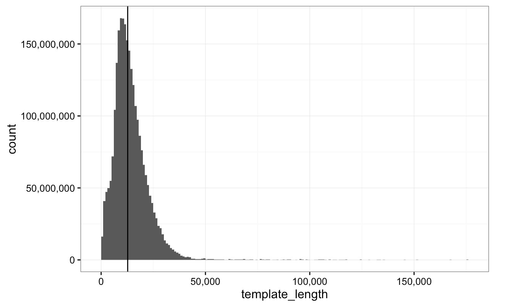

# Whole Human Genome Sequencing Project

## Introduction

We have sequenced the CEPH1463 (NA12878/GM12878, Ceph/Utah pedigree) human genome reference standard on the Oxford Nanopore MinION using 1D ligation kits (450 bp/s) using R9.4 chemistry (FLO-MIN106).

Human genomic DNA from GM12878 human cell line (Ceph/Utah pedigree) was either purchased from Coriell - "DNA" - (cat no NA12878) or extracted from the cultured cell line - "cells".  As the DNA is native, modified bases will be preserved.

# Data reuse and license

We encourage the reuse of this data in your own analysis and publications which is released under the Creative Commons CC-BY license. Therefore we would be grateful if you would cite the reference below if you do.

# Citation

Miten Jain, Sergey Koren, Karen H Miga, Josh Quick, Arthur C Rand, Thomas A Sasani, John R Tyson, Andrew D Beggs, Alexander T Dilthey, Ian T Fiddes, Sunir Malla, Hannah Marriott, Tom Nieto, Justin O'Grady, Hugh E Olsen, Brent S Pedersen, Arang Rhie, Hollian Richardson, Aaron R Quinlan, Terrance P Snutch, Louise Tee, Benedict Paten, Adam M Phillippy, Jared T Simpson, Nicholas J Loman & Matthew Loose. Nanopore sequencing and assembly of a human genome with ultra-long reads. Nature Biotechnology doi: <a href='https://doi.org/10.1038/nbt.4060>doi:10.1038/nbt.4060</a>

# Preprint

Miten Jain, Sergey Koren, Josh Quick, Arthur C Rand, Thomas A Sasani, John R Tyson, Andrew D Beggs, Alexander T Dilthey, Ian T Fiddes, Sunir Malla, Hannah Marriott, Karen H Miga, Tom Nieto, Justin O'Grady, Hugh E Olsen, Brent S Pedersen, Arang Rhie, Hollian Richardson, Aaron Quinlan, Terrance P Snutch, Louise Tee, Benedict Paten, Adam M. Phillippy, Jared T Simpson, Nicholas James Loman, Matthew Loose. Nanopore sequencing and assembly of a human genome with ultra-long reads. bioRxiv. doi: <a href="https://doi.org/10.1101/128835">https://doi.org/10.1101/128835</a>.

### rel3

#### Basecalls

The `rel3` release consists of the full dataset, and has two new rapid kit runs with a new long DNA extraction method:

* 39 flowcells
* 91240120433 bases
* 14183584 reads

| flowcell_id | reads  | bases      | Date     | Centre  | SampleType | Kit         | Pore | Links                                                                                              | 
|-------------|--------|------------|----------|---------|------------|-------------|------|----------------------------------------------------------------------------------------------------| 
| FAB23716    | 356209 | 1409812422 | 14/07/16 | UBC     | DNA        | Rapid       | R9   | [FASTQ](http://s3.amazonaws.com/nanopore-human-wgs/rel3-nanopore-wgs-4244727060-FAB23716.fastq.gz) | 
| FAB39088    | 658224 | 3287994454 | 19/09/16 | Notts   | DNA        | Ligation | R9.4 | [FASTQ](http://s3.amazonaws.com/nanopore-human-wgs/rel3-nanopore-wgs-288418386-FAB39088.fastq.gz)  | 
| FAB39075    | 466329 | 2439355478 | 20/09/16 | UBC     | DNA        | Ligation | R9.4 | [FASTQ](http://s3.amazonaws.com/nanopore-human-wgs/rel3-nanopore-wgs-4246400039-FAB39075.fastq.gz) | 
| FAB39043    | 436976 | 2273008592 | 23/09/16 | Bham    | DNA        | Ligation | R9.4 | [FASTQ](http://s3.amazonaws.com/nanopore-human-wgs/rel3-nanopore-wgs-3709921973-FAB39043.fastq.gz) | 
| FAB42706    | 430660 | 1966505502 | 12/10/16 | UBC     | DNA        | Ligation | R9.4 | [FASTQ](http://s3.amazonaws.com/nanopore-human-wgs/rel3-nanopore-wgs-4111103328-FAB42706.fastq.gz) | 
| FAB41174    | 117057 | 687394987  | 13/10/16 | Bham    | DNA        | Ligation | R9.4 | [FASTQ](http://s3.amazonaws.com/nanopore-human-wgs/rel3-nanopore-wgs-3976885577-FAB41174.fastq.gz) | 
| FAB42260    | 267644 | 1399557161 | 13/10/16 | UBC     | DNA        | Ligation | R9.4 | [FASTQ](http://s3.amazonaws.com/nanopore-human-wgs/rel3-nanopore-wgs-4177064552-FAB42260.fastq.gz) | 
| FAB42804    | 16669  | 75062609   | 14/10/16 | Bham    | DNA        | Ligation | R9.4 | [FASTQ](http://s3.amazonaws.com/nanopore-human-wgs/rel3-nanopore-wgs-84744914-FAB42804.fastq.gz)   | 
| FAB42316    | 572838 | 3275026637 | 14/10/16 | Notts   | DNA        | Ligation | R9.4 | [FASTQ](http://s3.amazonaws.com/nanopore-human-wgs/rel3-nanopore-wgs-216722908-FAB42316.fastq.gz)  | 
| FAB42205    | 317654 | 1686630108 | 14/10/16 | Notts   | DNA        | Ligation | R9.4 | [FASTQ](http://s3.amazonaws.com/nanopore-human-wgs/rel3-nanopore-wgs-3573838535-FAB42205.fastq.gz) | 
| FAB42561    | 233678 | 1520513556 | 19/10/16 | Notts   | DNA        | Ligation | R9.4 | [FASTQ](http://s3.amazonaws.com/nanopore-human-wgs/rel3-nanopore-wgs-356443753-FAB42561.fastq.gz)  | 
| FAB42473    | 644869 | 3357548938 | 19/10/16 | UBC     | DNA        | Ligation | R9.4 | [FASTQ](http://s3.amazonaws.com/nanopore-human-wgs/rel3-nanopore-wgs-4179682758-FAB42473.fastq.gz) | 
| FAB42395    | 38291  | 179704035  | 20/10/16 | Norwich | DNA        | Ligation | R9.4 | [FASTQ](http://s3.amazonaws.com/nanopore-human-wgs/rel3-nanopore-wgs-4178605061-FAB42395.fastq.gz) | 
| FAB42476    | 435158 | 2363036522 | 27/10/16 | UBC     | DNA        | Ligation | R9.4 | [FASTQ](http://s3.amazonaws.com/nanopore-human-wgs/rel3-nanopore-wgs-3843483077-FAB42476.fastq.gz) | 
| FAB42451    | 817629 | 4530477841 | 28/10/16 | Notts   | DNA        | Ligation | R9.4 | [FASTQ](http://s3.amazonaws.com/nanopore-human-wgs/rel3-nanopore-wgs-4239353418-FAB42451.fastq.gz) | 
| FAB42704    | 276152 | 1750149482 | 28/10/16 | UBC     | DNA        | Ligation | R9.4 | [FASTQ](http://s3.amazonaws.com/nanopore-human-wgs/rel3-nanopore-wgs-87746129-FAB42704.fastq.gz)   | 
| FAB42828    | 33527  | 163405138  | 01/11/16 | Norwich | DNA        | Ligation | R9.4 | [FASTQ](http://s3.amazonaws.com/nanopore-human-wgs/rel3-nanopore-wgs-288548394-FAB42828.fastq.gz)  | 
| FAB42810    | 322058 | 2020615256 | 02/11/16 | Norwich | DNA        | Ligation | R9.4 | [FASTQ](http://s3.amazonaws.com/nanopore-human-wgs/rel3-nanopore-wgs-352384898-FAB42810.fastq.gz)  | 
| FAB42798    | 193551 | 1339441522 | 03/11/16 | Norwich | DNA        | Ligation | R9.4 | [FASTQ](http://s3.amazonaws.com/nanopore-human-wgs/rel3-nanopore-wgs-3306352129-FAB42798.fastq.gz) | 
| FAB45280    | 128234 | 799554798  | 11/11/16 | Norwich | DNA        | Ligation | R9.4 | [FASTQ](http://s3.amazonaws.com/nanopore-human-wgs/rel3-nanopore-wgs-222619780-FAB45280.fastq.gz)  | 
| FAB46664    | 491346 | 2038018797 | 15/11/16 | UBC     | DNA        | Ligation | R9.4 | [FASTQ](http://s3.amazonaws.com/nanopore-human-wgs/rel3-nanopore-wgs-288286712-FAB46664.fastq.gz)  | 
| FAB46683    | 72605  | 286275511  | 17/11/16 | Bham    | DNA        | Ligation | R9.4 | [FASTQ](http://s3.amazonaws.com/nanopore-human-wgs/rel3-nanopore-wgs-4246923067-FAB46683.fastq.gz) | 
| FAB45332    | 530938 | 2864140853 | 17/11/16 | UBC     | DNA        | Ligation | R9.4 | [FASTQ](http://s3.amazonaws.com/nanopore-human-wgs/rel3-nanopore-wgs-551111640-FAB45332.fastq.gz)  | 
| FAB43577    | 426941 | 2539015084 | 18/11/16 | UCSC    | DNA        | Ligation | R9.4 | [FASTQ](http://s3.amazonaws.com/nanopore-human-wgs/rel3-nanopore-wgs-3574887596-FAB43577.fastq.gz) | 
| FAB44989    | 558224 | 3443824633 | 18/11/16 | UCSC    | DNA        | Ligation | R9.4 | [FASTQ](http://s3.amazonaws.com/nanopore-human-wgs/rel3-nanopore-wgs-2567311907-FAB44989.fastq.gz) | 
| FAF01169    | 339447 | 2913892142 | 22/11/16 | Bham    | Cells      | Ligation | R9.4 | [FASTQ](http://s3.amazonaws.com/nanopore-human-wgs/rel3-nanopore-wgs-4245879798-FAF01169.fastq.gz) | 
| FAF01441    | 254705 | 2203636947 | 22/11/16 | Bham    | Cells      | Ligation | R9.4 | [FASTQ](http://s3.amazonaws.com/nanopore-human-wgs/rel3-nanopore-wgs-3910073345-FAF01441.fastq.gz) | 
| FAB45277    | 53547  | 445641679  | 22/11/16 | Notts   | Cells      | Ligation | R9.4 | [FASTQ](http://s3.amazonaws.com/nanopore-human-wgs/rel3-nanopore-wgs-86567043-FAB45277.fastq.gz)   | 
| FAB45321    | 299174 | 2584017112 | 22/11/16 | Notts   | Cells      | Ligation | R9.4 | [FASTQ](http://s3.amazonaws.com/nanopore-human-wgs/rel3-nanopore-wgs-19064779-FAB45321.fastq.gz)   | 
| FAF01127    | 632728 | 4972081712 | 25/11/16 | Bham    | Cells      | Ligation | R9.4 | [FASTQ](http://s3.amazonaws.com/nanopore-human-wgs/rel3-nanopore-wgs-353303576-FAF01127.fastq.gz)  | 
| FAF01132    | 689781 | 5455971336 | 25/11/16 | Bham    | Cells      | Ligation | R9.4 | [FASTQ](http://s3.amazonaws.com/nanopore-human-wgs/rel3-nanopore-wgs-84868110-FAF01132.fastq.gz)   | 
| FAB49712    | 632158 | 4906148911 | 28/11/16 | Bham    | Cells      | Ligation | R9.4 | [FASTQ](http://s3.amazonaws.com/nanopore-human-wgs/rel3-nanopore-wgs-622291475-FAB49712.fastq.gz)  | 
| FAF01253    | 471698 | 3695661984 | 28/11/16 | Bham    | Cells      | Ligation | R9.4 | [FASTQ](http://s3.amazonaws.com/nanopore-human-wgs/rel3-nanopore-wgs-83756522-FAF01253.fastq.gz)   | 
| FAB45321*   | 123037 | 1043504055 | 28/11/16 | Notts   | Cells      | Ligation | R9.4 | [FASTQ](http://s3.amazonaws.com/nanopore-human-wgs/rel3-nanopore-wgs-285174896-FAB45321.fastq.gz) | 
| FAB49914    | 309175 | 2841008085 | 28/11/16 | Notts   | Cells      | Ligation | R9.4 | [FASTQ](http://s3.amazonaws.com/nanopore-human-wgs/rel3-nanopore-wgs-3775529215-FAB49914.fastq.gz) | 
| FAB45271    | 472656 | 3689043164 | 28/11/16 | Notts   | Cells      | Ligation | R9.4 | [FASTQ](http://s3.amazonaws.com/nanopore-human-wgs/rel3-nanopore-wgs-152889212-FAB45271.fastq.gz)  | 
| FAB49164    | 746333 | 4438258089 | 06/12/16 | UCSC    | DNA        | Ligation | R9.4 | [FASTQ](http://s3.amazonaws.com/nanopore-human-wgs/rel3-nanopore-wgs-4045668814-FAB49164.fastq.gz) | 
| FAB49908    | 224380 | 3141600861 | 09/12/16 | Bham    | Cells      | Rapid    | R9.4 | [FASTQ](http://s3.amazonaws.com/nanopore-human-wgs/rel3-nanopore-wgs-481119249-FAB49908.fastq.gz)  | 
| FAF04090    | 91304  | 1213584440 | 09/12/16 | Bham    | Cells      | Rapid    | R9.4 | [FASTQ](http://s3.amazonaws.com/nanopore-human-wgs/rel3-nanopore-wgs-3842965088-FAF04090.fastq.gz) | 

Please verify downloads against <a href="rel3-md5s.txt">MD5 hashes</a>.

[*] This flowcell ID was input incorrectly.

### rel4

Rel4 adds an additional 23140190547 bases in 1415868 reads, predominantly using the new ultra-long read protocol.

| asic_id    | nreads | mn    | count      | n50    | flowcell | centre | kit      | date       | sequencedate                                                                                       | 
|------------|--------|-------|------------|--------|----------|--------|----------|------------|----------------------------------------------------------------------------------------------------| 
| 16056159   | 82138  | 21998 | 1806857522 | 114375 | FAF15665 | Notts  | Ultra    | 10/03/2017 | [FASTQ](http://s3.amazonaws.com/nanopore-human-wgs/rel4-nanopore-wgs-16056159-FAF15665.fastq.gz)   | 
| 17958431   | 53723  | 23321 | 1252868852 | 77045  | FAF13748 | Notts  | Ultra    | 10/03/2017 | [FASTQ](http://s3.amazonaws.com/nanopore-human-wgs/rel4-nanopore-wgs-17958431-FAF13748.fastq.gz)   | 
| 2901545329 | 41385  | 20506 | 848632752  | 54473  | FAF10039 | Bham   | Ultra    | 01/03/2017 | [FASTQ](http://s3.amazonaws.com/nanopore-human-wgs/rel4-nanopore-wgs-2901545329-FAF10039.fastq.gz) | 
| 3439856925 | 19674  | 30217 | 594496244  | 121393 | FAF09968 | Bham   | Ultra    | 03/03/2017 | [FASTQ](http://s3.amazonaws.com/nanopore-human-wgs/rel4-nanopore-wgs-3439856925-FAF09968.fastq.gz) | 
| 3709819546 | 73755  | 26946 | 1987434656 | 117805 | FAF09277 | Bham   | Ultra    | 03/06/2017 | [FASTQ](http://s3.amazonaws.com/nanopore-human-wgs/rel4-nanopore-wgs-3709819546-FAF09277.fastq.gz) | 
| 3976726082 | 75692  | 24191 | 1831031405 | 88882  | FAF14035 | Notts  | Ultra    | 08/03/2017 | [FASTQ](http://s3.amazonaws.com/nanopore-human-wgs/rel4-nanopore-wgs-3976726082-FAF14035.fastq.gz) | 
| 4109802543 | 61227  | 25048 | 1533616061 | 104528 | FAF15694 | Bham   | Ultra    | 06/03/2017 | [FASTQ](http://s3.amazonaws.com/nanopore-human-wgs/rel4-nanopore-wgs-4109802543-FAF15694.fastq.gz) | 
| 4111860526 | 65142  | 25171 | 1639658993 | 93299  | FAF09713 | Bham   | Ultra    | 07/03/2017 | [FASTQ](http://s3.amazonaws.com/nanopore-human-wgs/rel4-nanopore-wgs-4111860526-FAF09713.fastq.gz) | 
| 4178920553 | 270189 | 10106 | 2730589684 | 24848  | FAF18554 | UBC    | Rapid    | 06/03/2017 | [FASTQ](http://s3.amazonaws.com/nanopore-human-wgs/rel4-nanopore-wgs-4178920553-FAF18554.fastq.gz) | 
| 4244782843 | 9663   | 33401 | 322753214  | 102804 | FAF15630 | Notts  | Ultra    | 09/03/2017 | [FASTQ](http://s3.amazonaws.com/nanopore-human-wgs/rel4-nanopore-wgs-4244782843-FAF15630.fastq.gz) | 
| 4245291640 | 72936  | 20524 | 1496943560 | 92109  | FAF09640 | Bham   | Ultra    | 07/03/2017 | [FASTQ](http://s3.amazonaws.com/nanopore-human-wgs/rel4-nanopore-wgs-4245291640-FAF09640.fastq.gz) | 
| 4249180049 | 68169  | 25394 | 1731054841 | 119444 | FAF09701 | Bham   | Ultra    | 03/03/2017 | [FASTQ](http://s3.amazonaws.com/nanopore-human-wgs/rel4-nanopore-wgs-4249180049-FAF09701.fastq.gz) | 
| 82266371   | 71155  | 24602 | 1750584936 | 118548 | FAF15586 | Bham   | Ultra    | 08/03/2017 | [FASTQ](http://s3.amazonaws.com/nanopore-human-wgs/rel4-nanopore-wgs-82266371-FAF15586.fastq.gz)   | 
| 87644245   | 451020 | 8012  | 3613667827 | 13920  | FAF05869 | UBC    | Ligation | 08/03/2017 | [FASTQ](http://s3.amazonaws.com/nanopore-human-wgs/rel4-nanopore-wgs-87644245-FAF05869.fastq.gz)   | 

### Alignments by flowcell

Reads for the rel3 (30x coverage dataset) aligned against pre-computed 1000 genomes GRCh38 BWA database at <ftp://ftp-trace.ncbi.nih.gov/1000genomes/ftp/technical/reference/GRCh38_reference_genome/> with decoys using BWA MEM (commit: `5961611c358e480110793bbf241523a3cfac049b`) using parameters `-x ont2d`. Alignment statistics calculated using `samtools stats` (samtools version 1.3.1).

| FileID   | Sequences | Mapped | Mapped MQ0 | Unmapped | Bases Mapped | Avg Length | Link                                                                                                        |                                                                                                                 | 
|----------|-----------|--------|------------|----------|--------------|------------|-------------------------------------------------------------------------------------------------------------|-----------------------------------------------------------------------------------------------------------------| 
| FAB23716 | 356209    | 319259 | 26702      | 36950    | 1165998694   | 3957       | [BAM](http://s3.amazonaws.com/nanopore-human-wgs/rel3-nanopore-wgs-4244727060-FAB23716.fastq.gz.sorted.bam) | [BAI](http://s3.amazonaws.com/nanopore-human-wgs/rel3-nanopore-wgs-4244727060-FAB23716.fastq.gz.sorted.bam.bai) | 
| FAB39088 | 658224    | 613044 | 35394      | 45180    | 3007307322   | 4995       | [BAM](http://s3.amazonaws.com/nanopore-human-wgs/rel3-nanopore-wgs-288418386-FAB39088.fastq.gz.sorted.bam)  | [BAI](http://s3.amazonaws.com/nanopore-human-wgs/rel3-nanopore-wgs-288418386-FAB39088.fastq.gz.sorted.bam.bai)  | 
| FAB39075 | 466329    | 425117 | 28167      | 41212    | 2146453407   | 5230       | [BAM](http://s3.amazonaws.com/nanopore-human-wgs/rel3-nanopore-wgs-4246400039-FAB39075.fastq.gz.sorted.bam) | [BAI](http://s3.amazonaws.com/nanopore-human-wgs/rel3-nanopore-wgs-4246400039-FAB39075.fastq.gz.sorted.bam.bai) | 
| FAB39043 | 436976    | 415389 | 21043      | 21587    | 2113140439   | 5201       | [BAM](http://s3.amazonaws.com/nanopore-human-wgs/rel3-nanopore-wgs-3709921973-FAB39043.fastq.gz.sorted.bam) | [BAI](http://s3.amazonaws.com/nanopore-human-wgs/rel3-nanopore-wgs-3709921973-FAB39043.fastq.gz.sorted.bam.bai) | 
| FAB42706 | 430660    | 375374 | 17378      | 55286    | 1867123361   | 4566       | [BAM](http://s3.amazonaws.com/nanopore-human-wgs/rel3-nanopore-wgs-4111103328-FAB42706.fastq.gz.sorted.bam) | [BAI](http://s3.amazonaws.com/nanopore-human-wgs/rel3-nanopore-wgs-4111103328-FAB42706.fastq.gz.sorted.bam.bai) | 
| FAB41174 | 117057    | 114520 | 4186       | 2537     | 652217119    | 5872       | [BAM](http://s3.amazonaws.com/nanopore-human-wgs/rel3-nanopore-wgs-3976885577-FAB41174.fastq.gz.sorted.bam) | [BAI](http://s3.amazonaws.com/nanopore-human-wgs/rel3-nanopore-wgs-3976885577-FAB41174.fastq.gz.sorted.bam.bai) | 
| FAB42260 | 267644    | 246982 | 15624      | 20662    | 1263089767   | 5229       | [BAM](http://s3.amazonaws.com/nanopore-human-wgs/rel3-nanopore-wgs-4177064552-FAB42260.fastq.gz.sorted.bam) | [BAI](http://s3.amazonaws.com/nanopore-human-wgs/rel3-nanopore-wgs-4177064552-FAB42260.fastq.gz.sorted.bam.bai) | 
| FAB42804 | 16669     | 13311  | 1755       | 3358     | 53666089     | 4503       | [BAM](http://s3.amazonaws.com/nanopore-human-wgs/rel3-nanopore-wgs-84744914-FAB42804.fastq.gz.sorted.bam)   | [BAI](http://s3.amazonaws.com/nanopore-human-wgs/rel3-nanopore-wgs-84744914-FAB42804.fastq.gz.sorted.bam.bai)   | 
| FAB42316 | 572838    | 512994 | 18985      | 59844    | 3100596254   | 5717       | [BAM](http://s3.amazonaws.com/nanopore-human-wgs/rel3-nanopore-wgs-216722908-FAB42316.fastq.gz.sorted.bam)  | [BAI](http://s3.amazonaws.com/nanopore-human-wgs/rel3-nanopore-wgs-216722908-FAB42316.fastq.gz.sorted.bam.bai)  | 
| FAB42205 | 317654    | 282502 | 12561      | 35152    | 1601397762   | 5309       | [BAM](http://s3.amazonaws.com/nanopore-human-wgs/rel3-nanopore-wgs-3573838535-FAB42205.fastq.gz.sorted.bam) | [BAI](http://s3.amazonaws.com/nanopore-human-wgs/rel3-nanopore-wgs-3573838535-FAB42205.fastq.gz.sorted.bam.bai) | 
| FAB42561 | 233678    | 225141 | 10255      | 8537     | 1420740185   | 6506       | [BAM](http://s3.amazonaws.com/nanopore-human-wgs/rel3-nanopore-wgs-356443753-FAB42561.fastq.gz.sorted.bam)  | [BAI](http://s3.amazonaws.com/nanopore-human-wgs/rel3-nanopore-wgs-356443753-FAB42561.fastq.gz.sorted.bam.bai)  | 
| FAB42473 | 644869    | 611138 | 32539      | 33731    | 3112342902   | 5206       | [BAM](http://s3.amazonaws.com/nanopore-human-wgs/rel3-nanopore-wgs-4179682758-FAB42473.fastq.gz.sorted.bam) | [BAI](http://s3.amazonaws.com/nanopore-human-wgs/rel3-nanopore-wgs-4179682758-FAB42473.fastq.gz.sorted.bam.bai) | 
| FAB42395 | 38291     | 36477  | 2059       | 1814     | 167168840    | 4693       | [BAM](http://s3.amazonaws.com/nanopore-human-wgs/rel3-nanopore-wgs-4178605061-FAB42395.fastq.gz.sorted.bam) | [BAI](http://s3.amazonaws.com/nanopore-human-wgs/rel3-nanopore-wgs-4178605061-FAB42395.fastq.gz.sorted.bam.bai) | 
| FAB42476 | 435158    | 416969 | 20908      | 18189    | 2214880871   | 5430       | [BAM](http://s3.amazonaws.com/nanopore-human-wgs/rel3-nanopore-wgs-3843483077-FAB42476.fastq.gz.sorted.bam) | [BAI](http://s3.amazonaws.com/nanopore-human-wgs/rel3-nanopore-wgs-3843483077-FAB42476.fastq.gz.sorted.bam.bai) | 
| FAB42451 | 817629    | 779328 | 36986      | 38301    | 4178966543   | 5540       | [BAM](http://s3.amazonaws.com/nanopore-human-wgs/rel3-nanopore-wgs-4239353418-FAB42451.fastq.gz.sorted.bam) | [BAI](http://s3.amazonaws.com/nanopore-human-wgs/rel3-nanopore-wgs-4239353418-FAB42451.fastq.gz.sorted.bam.bai) | 
| FAB42704 | 276152    | 263722 | 12926      | 12430    | 1619875186   | 6337       | [BAM](http://s3.amazonaws.com/nanopore-human-wgs/rel3-nanopore-wgs-87746129-FAB42704.fastq.gz.sorted.bam)   | [BAI](http://s3.amazonaws.com/nanopore-human-wgs/rel3-nanopore-wgs-87746129-FAB42704.fastq.gz.sorted.bam.bai)   | 
| FAB42828 | 33527     | 27843  | 2442       | 5684     | 146819837    | 4873       | [BAM](http://s3.amazonaws.com/nanopore-human-wgs/rel3-nanopore-wgs-288548394-FAB42828.fastq.gz.sorted.bam)  | [BAI](http://s3.amazonaws.com/nanopore-human-wgs/rel3-nanopore-wgs-288548394-FAB42828.fastq.gz.sorted.bam.bai)  | 
| FAB42810 | 322058    | 305070 | 16802      | 16988    | 1808343119   | 6274       | [BAM](http://s3.amazonaws.com/nanopore-human-wgs/rel3-nanopore-wgs-352384898-FAB42810.fastq.gz.sorted.bam)  | [BAI](http://s3.amazonaws.com/nanopore-human-wgs/rel3-nanopore-wgs-352384898-FAB42810.fastq.gz.sorted.bam.bai)  | 
| FAB42798 | 193551    | 185739 | 8749       | 7812     | 1232035338   | 6920       | [BAM](http://s3.amazonaws.com/nanopore-human-wgs/rel3-nanopore-wgs-3306352129-FAB42798.fastq.gz.sorted.bam) | [BAI](http://s3.amazonaws.com/nanopore-human-wgs/rel3-nanopore-wgs-3306352129-FAB42798.fastq.gz.sorted.bam.bai) | 
| FAB45280 | 128234    | 122219 | 6336       | 6015     | 743280816    | 6235       | [BAM](http://s3.amazonaws.com/nanopore-human-wgs/rel3-nanopore-wgs-222619780-FAB45280.fastq.gz.sorted.bam)  | [BAI](http://s3.amazonaws.com/nanopore-human-wgs/rel3-nanopore-wgs-222619780-FAB45280.fastq.gz.sorted.bam.bai)  | 
| FAB46664 | 491346    | 456247 | 27622      | 35099    | 1862427349   | 4147       | [BAM](http://s3.amazonaws.com/nanopore-human-wgs/rel3-nanopore-wgs-288286712-FAB46664.fastq.gz.sorted.bam)  | [BAI](http://s3.amazonaws.com/nanopore-human-wgs/rel3-nanopore-wgs-288286712-FAB46664.fastq.gz.sorted.bam.bai)  | 
| FAB46683 | 72605     | 64739  | 5307       | 7866     | 269213160    | 3942       | [BAM](http://s3.amazonaws.com/nanopore-human-wgs/rel3-nanopore-wgs-4246923067-FAB46683.fastq.gz.sorted.bam) | [BAI](http://s3.amazonaws.com/nanopore-human-wgs/rel3-nanopore-wgs-4246923067-FAB46683.fastq.gz.sorted.bam.bai) | 
| FAB45332 | 530938    | 497862 | 26392      | 33076    | 2620752139   | 5394       | [BAM](http://s3.amazonaws.com/nanopore-human-wgs/rel3-nanopore-wgs-551111640-FAB45332.fastq.gz.sorted.bam)  | [BAI](http://s3.amazonaws.com/nanopore-human-wgs/rel3-nanopore-wgs-551111640-FAB45332.fastq.gz.sorted.bam.bai)  | 
| FAB43577 | 426941    | 410137 | 19835      | 16804    | 2344990054   | 5946       | [BAM](http://s3.amazonaws.com/nanopore-human-wgs/rel3-nanopore-wgs-3574887596-FAB43577.fastq.gz.sorted.bam) | [BAI](http://s3.amazonaws.com/nanopore-human-wgs/rel3-nanopore-wgs-3574887596-FAB43577.fastq.gz.sorted.bam.bai) | 
| FAB44989 | 558224    | 536572 | 25936      | 21652    | 3161900821   | 6169       | [BAM](http://s3.amazonaws.com/nanopore-human-wgs/rel3-nanopore-wgs-2567311907-FAB44989.fastq.gz.sorted.bam) | [BAI](http://s3.amazonaws.com/nanopore-human-wgs/rel3-nanopore-wgs-2567311907-FAB44989.fastq.gz.sorted.bam.bai) | 
| FAF01169 | 339447    | 315489 | 16481      | 23958    | 2677881316   | 8584       | [BAM](http://s3.amazonaws.com/nanopore-human-wgs/rel3-nanopore-wgs-4245879798-FAF01169.fastq.gz.sorted.bam) | [BAI](http://s3.amazonaws.com/nanopore-human-wgs/rel3-nanopore-wgs-4245879798-FAF01169.fastq.gz.sorted.bam.bai) | 
| FAF01441 | 254705    | 238834 | 12458      | 15871    | 2010117898   | 8651       | [BAM](http://s3.amazonaws.com/nanopore-human-wgs/rel3-nanopore-wgs-3910073345-FAF01441.fastq.gz.sorted.bam) | [BAI](http://s3.amazonaws.com/nanopore-human-wgs/rel3-nanopore-wgs-3910073345-FAF01441.fastq.gz.sorted.bam.bai) | 
| FAB45277 | 53547     | 51957  | 2132       | 1590     | 426639054    | 8322       | [BAM](http://s3.amazonaws.com/nanopore-human-wgs/rel3-nanopore-wgs-86567043-FAB45277.fastq.gz.sorted.bam)   | [BAI](http://s3.amazonaws.com/nanopore-human-wgs/rel3-nanopore-wgs-86567043-FAB45277.fastq.gz.sorted.bam.bai)   | 
| FAB45321 | 299174    | 283355 | 15165      | 15819    | 2366003310   | 8637       | [BAM](http://s3.amazonaws.com/nanopore-human-wgs/rel3-nanopore-wgs-19064779-FAB45321.fastq.gz.sorted.bam)   | [BAI](http://s3.amazonaws.com/nanopore-human-wgs/rel3-nanopore-wgs-19064779-FAB45321.fastq.gz.sorted.bam.bai)   | 
| FAF01127 | 632728    | 605633 | 27192      | 27095    | 4640355789   | 7858       | [BAM](http://s3.amazonaws.com/nanopore-human-wgs/rel3-nanopore-wgs-353303576-FAF01127.fastq.gz.sorted.bam)  | [BAI](http://s3.amazonaws.com/nanopore-human-wgs/rel3-nanopore-wgs-353303576-FAF01127.fastq.gz.sorted.bam.bai)  | 
| FAF01132 | 689781    | 655357 | 33564      | 34424    | 4966810089   | 7909       | [BAM](http://s3.amazonaws.com/nanopore-human-wgs/rel3-nanopore-wgs-84868110-FAF01132.fastq.gz.sorted.bam)   | [BAI](http://s3.amazonaws.com/nanopore-human-wgs/rel3-nanopore-wgs-84868110-FAF01132.fastq.gz.sorted.bam.bai)   | 
| FAB49712 | 632158    | 612752 | 26264      | 19406    | 4594356245   | 7760       | [BAM](http://s3.amazonaws.com/nanopore-human-wgs/rel3-nanopore-wgs-622291475-FAB49712.fastq.gz.sorted.bam)  | [BAI](http://s3.amazonaws.com/nanopore-human-wgs/rel3-nanopore-wgs-622291475-FAB49712.fastq.gz.sorted.bam.bai)  | 
| FAF01253 | 471698    | 454434 | 20639      | 17264    | 3430678969   | 7834       | [BAM](http://s3.amazonaws.com/nanopore-human-wgs/rel3-nanopore-wgs-83756522-FAF01253.fastq.gz.sorted.bam)   | [BAI](http://s3.amazonaws.com/nanopore-human-wgs/rel3-nanopore-wgs-83756522-FAF01253.fastq.gz.sorted.bam.bai)   | 
| FAB45321 | 123037    | 118311 | 5891       | 4726     | 952851126    | 8481       | [BAM](http://s3.amazonaws.com/nanopore-human-wgs/rel3-nanopore-wgs-285174896-FAB45321.fastq.gz.sorted.bam)  | [BAI](http://s3.amazonaws.com/nanopore-human-wgs/rel3-nanopore-wgs-285174896-FAB45321.fastq.gz.sorted.bam.bai)  | 
| FAB49914 | 309175    | 296250 | 12281      | 12925    | 2673848960   | 9188       | [BAM](http://s3.amazonaws.com/nanopore-human-wgs/rel3-nanopore-wgs-3775529215-FAB49914.fastq.gz.sorted.bam) | [BAI](http://s3.amazonaws.com/nanopore-human-wgs/rel3-nanopore-wgs-3775529215-FAB49914.fastq.gz.sorted.bam.bai) | 
| FAB45271 | 472656    | 450702 | 20148      | 21954    | 3468377327   | 7804       | [BAM](http://s3.amazonaws.com/nanopore-human-wgs/rel3-nanopore-wgs-152889212-FAB45271.fastq.gz.sorted.bam)  | [BAI](http://s3.amazonaws.com/nanopore-human-wgs/rel3-nanopore-wgs-152889212-FAB45271.fastq.gz.sorted.bam.bai)  | 
| FAB49164 | 746333    | 718351 | 32664      | 27982    | 4107087899   | 5946       | [BAM](http://s3.amazonaws.com/nanopore-human-wgs/rel3-nanopore-wgs-4045668814-FAB49164.fastq.gz.sorted.bam) | [BAI](http://s3.amazonaws.com/nanopore-human-wgs/rel3-nanopore-wgs-4045668814-FAB49164.fastq.gz.sorted.bam.bai) | 
| FAB49908 | 224380    | 211060 | 11903      | 13320    | 2898563539   | 14001      | [BAM](http://s3.amazonaws.com/nanopore-human-wgs/rel3-nanopore-wgs-481119249-FAB49908.fastq.gz.sorted.bam)  | [BAI](http://s3.amazonaws.com/nanopore-human-wgs/rel3-nanopore-wgs-481119249-FAB49908.fastq.gz.sorted.bam.bai)  | 
| FAF04090 | 91304     | 83164  | 6072       | 8140     | 1085757398   | 13291      | [BAM](http://s3.amazonaws.com/nanopore-human-wgs/rel3-nanopore-wgs-3842965088-FAF04090.fastq.gz.sorted.bam) | [BAI](http://s3.amazonaws.com/nanopore-human-wgs/rel3-nanopore-wgs-3842965088-FAF04090.fastq.gz.sorted.bam.bai) | 

#### Alignments by chromosome

Flowcell alignments were separated into individual chromosomes using `samtools merge`.

| Chrom | Mapped # | Mapped MQ0 | Bases Mapped | Avg Length | BAM                                                                | BAI                                                                    | 
|-------|----------|------------|--------------|------------|--------------------------------------------------------------------|------------------------------------------------------------------------| 
| chr1  | 1075867  | 43397      | 6829526262   | 6744       | [BAM](http://s3.amazonaws.com/nanopore-human-wgs/chr1.sorted.bam)  | [BAI](http://s3.amazonaws.com/nanopore-human-wgs/chr1.sorted.bam.bai)  | 
| chr2  | 1062314  | 31802      | 6755642896   | 6842       | [BAM](http://s3.amazonaws.com/nanopore-human-wgs/chr2.sorted.bam)  | [BAI](http://s3.amazonaws.com/nanopore-human-wgs/chr2.sorted.bam.bai)  | 
| chr3  | 858643   | 24189      | 5487703898   | 6757       | [BAM](http://s3.amazonaws.com/nanopore-human-wgs/chr3.sorted.bam)  | [BAI](http://s3.amazonaws.com/nanopore-human-wgs/chr3.sorted.bam.bai)  | 
| chr4  | 845677   | 30723      | 5395140705   | 6890       | [BAM](http://s3.amazonaws.com/nanopore-human-wgs/chr4.sorted.bam)  | [BAI](http://s3.amazonaws.com/nanopore-human-wgs/chr4.sorted.bam.bai)  | 
| chr5  | 774613   | 23499      | 4953273570   | 6821       | [BAM](http://s3.amazonaws.com/nanopore-human-wgs/chr5.sorted.bam)  | [BAI](http://s3.amazonaws.com/nanopore-human-wgs/chr5.sorted.bam.bai)  | 
| chr6  | 723047   | 24496      | 4618883250   | 6762       | [BAM](http://s3.amazonaws.com/nanopore-human-wgs/chr6.sorted.bam)  | [BAI](http://s3.amazonaws.com/nanopore-human-wgs/chr6.sorted.bam.bai)  | 
| chr7  | 696473   | 28231      | 4382999832   | 6772       | [BAM](http://s3.amazonaws.com/nanopore-human-wgs/chr7.sorted.bam)  | [BAI](http://s3.amazonaws.com/nanopore-human-wgs/chr7.sorted.bam.bai)  | 
| chr8  | 617988   | 23361      | 3968911801   | 6844       | [BAM](http://s3.amazonaws.com/nanopore-human-wgs/chr8.sorted.bam)  | [BAI](http://s3.amazonaws.com/nanopore-human-wgs/chr8.sorted.bam.bai)  | 
| chr9  | 539660   | 25898      | 3428430670   | 6764       | [BAM](http://s3.amazonaws.com/nanopore-human-wgs/chr9.sorted.bam)  | [BAI](http://s3.amazonaws.com/nanopore-human-wgs/chr9.sorted.bam.bai)  | 
| chr10 | 594688   | 20787      | 3805443564   | 6845       | [BAM](http://s3.amazonaws.com/nanopore-human-wgs/chr10.sorted.bam) | [BAI](http://s3.amazonaws.com/nanopore-human-wgs/chr10.sorted.bam.bai) | 
| chr11 | 583055   | 17748      | 3710684724   | 6855       | [BAM](http://s3.amazonaws.com/nanopore-human-wgs/chr11.sorted.bam) | [BAI](http://s3.amazonaws.com/nanopore-human-wgs/chr11.sorted.bam.bai) | 
| chr12 | 586663   | 17891      | 3734922623   | 6840       | [BAM](http://s3.amazonaws.com/nanopore-human-wgs/chr12.sorted.bam) | [BAI](http://s3.amazonaws.com/nanopore-human-wgs/chr12.sorted.bam.bai) | 
| chr13 | 440615   | 17662      | 2844212242   | 6904       | [BAM](http://s3.amazonaws.com/nanopore-human-wgs/chr13.sorted.bam) | [BAI](http://s3.amazonaws.com/nanopore-human-wgs/chr13.sorted.bam.bai) | 
| chr14 | 383777   | 15752      | 2439119767   | 6713       | [BAM](http://s3.amazonaws.com/nanopore-human-wgs/chr14.sorted.bam) | [BAI](http://s3.amazonaws.com/nanopore-human-wgs/chr14.sorted.bam.bai) | 
| chr15 | 359853   | 19556      | 2268233023   | 6838       | [BAM](http://s3.amazonaws.com/nanopore-human-wgs/chr15.sorted.bam) | [BAI](http://s3.amazonaws.com/nanopore-human-wgs/chr15.sorted.bam.bai) | 
| chr16 | 386401   | 22680      | 2425913744   | 6787       | [BAM](http://s3.amazonaws.com/nanopore-human-wgs/chr16.sorted.bam) | [BAI](http://s3.amazonaws.com/nanopore-human-wgs/chr16.sorted.bam.bai) | 
| chr17 | 369036   | 22907      | 2302471086   | 6661       | [BAM](http://s3.amazonaws.com/nanopore-human-wgs/chr17.sorted.bam) | [BAI](http://s3.amazonaws.com/nanopore-human-wgs/chr17.sorted.bam.bai) | 
| chr18 | 339094   | 13053      | 2172098564   | 6807       | [BAM](http://s3.amazonaws.com/nanopore-human-wgs/chr18.sorted.bam) | [BAI](http://s3.amazonaws.com/nanopore-human-wgs/chr18.sorted.bam.bai) | 
| chr19 | 257039   | 10926      | 1472760724   | 6266       | [BAM](http://s3.amazonaws.com/nanopore-human-wgs/chr19.sorted.bam) | [BAI](http://s3.amazonaws.com/nanopore-human-wgs/chr19.sorted.bam.bai) | 
| chr20 | 291960   | 13226      | 1829244829   | 6659       | [BAM](http://s3.amazonaws.com/nanopore-human-wgs/chr20.sorted.bam) | [BAI](http://s3.amazonaws.com/nanopore-human-wgs/chr20.sorted.bam.bai) | 
| chr21 | 192383   | 24988      | 1207807437   | 6792       | [BAM](http://s3.amazonaws.com/nanopore-human-wgs/chr21.sorted.bam) | [BAI](http://s3.amazonaws.com/nanopore-human-wgs/chr21.sorted.bam.bai) | 
| chr22 | 172934   | 10514      | 1041347396   | 6665       | [BAM](http://s3.amazonaws.com/nanopore-human-wgs/chr22.sorted.bam) | [BAI](http://s3.amazonaws.com/nanopore-human-wgs/chr22.sorted.bam.bai) | 
| chrX  | 658347   | 28769      | 4210769167   | 7076       | [BAM](http://s3.amazonaws.com/nanopore-human-wgs/chrX.sorted.bam)  | [BAI](http://s3.amazonaws.com/nanopore-human-wgs/chrX.sorted.bam.bai)  | 
| chrY  | 23378    | 5292       | 133803203    | 7869       | [BAM](http://s3.amazonaws.com/nanopore-human-wgs/chrY.sorted.bam)  | [BAI](http://s3.amazonaws.com/nanopore-human-wgs/chrY.sorted.bam.bai)  | 
| chrM  | 59363    | 658        | 91949786     | 1628       | [BAM](http://s3.amazonaws.com/nanopore-human-wgs/chrM.sorted.bam)  | [BAI](http://s3.amazonaws.com/nanopore-human-wgs/chrM.sorted.bam.bai)  | 

# FAST5 (Signal Level files)

FAST5 files for 30x dataset have been split by chromosome according to the above alignments, meaning that some files may be found in multiple archives (they can be made non-redundant by reference to the filename). Each complete 'part' contains 100,000 reads and should be roughly in sort order along the chromosome to aid region-by-region analysis. 

| chrom      |                                                                                         |                                                                                         |                                                                                         |                                                                                         |                                                                                         |                                                                                         |                                                                                         |                                                                                         |                                                                                        | 
|-------|-----------------------------------------------------------------------------------------|-----------------------------------------------------------------------------------------|-----------------------------------------------------------------------------------------|-----------------------------------------------------------------------------------------|-----------------------------------------------------------------------------------------|-----------------------------------------------------------------------------------------|-----------------------------------------------------------------------------------------|-----------------------------------------------------------------------------------------|----------------------------------------------------------------------------------------| 
| chr1  | [part1 (391 G)](http://s3.amazonaws.com/nanopore-human-wgs/rel3-fast5-chr1.part01.tar)  | [part2 (291 G)](http://s3.amazonaws.com/nanopore-human-wgs/rel3-fast5-chr1.part02.tar)  | [part3 (284 G)](http://s3.amazonaws.com/nanopore-human-wgs/rel3-fast5-chr1.part03.tar)  | [part4 (265 G)](http://s3.amazonaws.com/nanopore-human-wgs/rel3-fast5-chr1.part04.tar)  | [part5 (265 G)](http://s3.amazonaws.com/nanopore-human-wgs/rel3-fast5-chr1.part05.tar)  | [part6 (242 G)](http://s3.amazonaws.com/nanopore-human-wgs/rel3-fast5-chr1.part06.tar)  | [part7 (269 G)](http://s3.amazonaws.com/nanopore-human-wgs/rel3-fast5-chr1.part07.tar)  | [part8 (202 G)](http://s3.amazonaws.com/nanopore-human-wgs/rel3-fast5-chr1.part08.tar)  | [part9 (205 G)](http://s3.amazonaws.com/nanopore-human-wgs/rel3-fast5-chr1.part09.tar) | 
| chr2  | [part1 (395 G)](http://s3.amazonaws.com/nanopore-human-wgs/rel3-fast5-chr2.part01.tar)  | [part2 (311 G)](http://s3.amazonaws.com/nanopore-human-wgs/rel3-fast5-chr2.part02.tar)  | [part3 (279 G)](http://s3.amazonaws.com/nanopore-human-wgs/rel3-fast5-chr2.part03.tar)  | [part4 (287 G)](http://s3.amazonaws.com/nanopore-human-wgs/rel3-fast5-chr2.part04.tar)  | [part5 (288 G)](http://s3.amazonaws.com/nanopore-human-wgs/rel3-fast5-chr2.part05.tar)  | [part6 (300 G)](http://s3.amazonaws.com/nanopore-human-wgs/rel3-fast5-chr2.part06.tar)  | [part7 (266 G)](http://s3.amazonaws.com/nanopore-human-wgs/rel3-fast5-chr2.part07.tar)  | [part8 (247 G)](http://s3.amazonaws.com/nanopore-human-wgs/rel3-fast5-chr2.part08.tar)  | [part9 (223 G)](http://s3.amazonaws.com/nanopore-human-wgs/rel3-fast5-chr2.part09.tar) | 
| chr3  | [part1 (338 G)](http://s3.amazonaws.com/nanopore-human-wgs/rel3-fast5-chr3.part01.tar)  | [part2 (310 G)](http://s3.amazonaws.com/nanopore-human-wgs/rel3-fast5-chr3.part02.tar)  | [part3 (308 G)](http://s3.amazonaws.com/nanopore-human-wgs/rel3-fast5-chr3.part03.tar)  | [part4 (249 G)](http://s3.amazonaws.com/nanopore-human-wgs/rel3-fast5-chr3.part04.tar)  | [part5 (290 G)](http://s3.amazonaws.com/nanopore-human-wgs/rel3-fast5-chr3.part05.tar)  | [part6 (265 G)](http://s3.amazonaws.com/nanopore-human-wgs/rel3-fast5-chr3.part06.tar)  | [part7 (278 G)](http://s3.amazonaws.com/nanopore-human-wgs/rel3-fast5-chr3.part07.tar)  | [part8 (220 G)](http://s3.amazonaws.com/nanopore-human-wgs/rel3-fast5-chr3.part08.tar)  | [part9 (236 G)](http://s3.amazonaws.com/nanopore-human-wgs/rel3-fast5-chr3.part09.tar) | 
| chr4  | [part1 (423 G)](http://s3.amazonaws.com/nanopore-human-wgs/rel3-fast5-chr4.part01.tar)  | [part2 (346 G)](http://s3.amazonaws.com/nanopore-human-wgs/rel3-fast5-chr4.part02.tar)  | [part3 (344 G)](http://s3.amazonaws.com/nanopore-human-wgs/rel3-fast5-chr4.part03.tar)  | [part4 (245 G)](http://s3.amazonaws.com/nanopore-human-wgs/rel3-fast5-chr4.part04.tar)  | [part5 (321 G)](http://s3.amazonaws.com/nanopore-human-wgs/rel3-fast5-chr4.part05.tar)  | [part6 (237 G)](http://s3.amazonaws.com/nanopore-human-wgs/rel3-fast5-chr4.part06.tar)  | [part7 (379 G)](http://s3.amazonaws.com/nanopore-human-wgs/rel3-fast5-chr4.part07.tar)  | [part8 (214 G)](http://s3.amazonaws.com/nanopore-human-wgs/rel3-fast5-chr4.part08.tar)  | [part9 (213 G)](http://s3.amazonaws.com/nanopore-human-wgs/rel3-fast5-chr4.part09.tar) | 
| chr5  | [part1 (385 G)](http://s3.amazonaws.com/nanopore-human-wgs/rel3-fast5-chr5.part01.tar)  | [part2 (393 G)](http://s3.amazonaws.com/nanopore-human-wgs/rel3-fast5-chr5.part02.tar)  | [part3 (286 G)](http://s3.amazonaws.com/nanopore-human-wgs/rel3-fast5-chr5.part03.tar)  | [part4 (286 G)](http://s3.amazonaws.com/nanopore-human-wgs/rel3-fast5-chr5.part04.tar)  | [part5 (264 G)](http://s3.amazonaws.com/nanopore-human-wgs/rel3-fast5-chr5.part05.tar)  | [part6 (298 G)](http://s3.amazonaws.com/nanopore-human-wgs/rel3-fast5-chr5.part06.tar)  | [part7 (259 G)](http://s3.amazonaws.com/nanopore-human-wgs/rel3-fast5-chr5.part07.tar)  | [part8 (215 G)](http://s3.amazonaws.com/nanopore-human-wgs/rel3-fast5-chr5.part08.tar)  | [part9 (207 G)](http://s3.amazonaws.com/nanopore-human-wgs/rel3-fast5-chr5.part09.tar) | 
| chr6  | [part1 (313 G)](http://s3.amazonaws.com/nanopore-human-wgs/rel3-fast5-chr6.part01.tar)  | [part2 (319 G)](http://s3.amazonaws.com/nanopore-human-wgs/rel3-fast5-chr6.part02.tar)  | [part3 (298 G)](http://s3.amazonaws.com/nanopore-human-wgs/rel3-fast5-chr6.part03.tar)  | [part4 (318 G)](http://s3.amazonaws.com/nanopore-human-wgs/rel3-fast5-chr6.part04.tar)  | [part5 (263 G)](http://s3.amazonaws.com/nanopore-human-wgs/rel3-fast5-chr6.part05.tar)  | [part6 (258 G)](http://s3.amazonaws.com/nanopore-human-wgs/rel3-fast5-chr6.part06.tar)  | [part7 (264 G)](http://s3.amazonaws.com/nanopore-human-wgs/rel3-fast5-chr6.part07.tar)  | [part8 (230 G)](http://s3.amazonaws.com/nanopore-human-wgs/rel3-fast5-chr6.part08.tar)  | [part9 (207 G)](http://s3.amazonaws.com/nanopore-human-wgs/rel3-fast5-chr6.part09.tar) | 
| chr7  | [part1 (366 G)](http://s3.amazonaws.com/nanopore-human-wgs/rel3-fast5-chr7.part01.tar)  | [part2 (332 G)](http://s3.amazonaws.com/nanopore-human-wgs/rel3-fast5-chr7.part02.tar)  | [part3 (308 G)](http://s3.amazonaws.com/nanopore-human-wgs/rel3-fast5-chr7.part03.tar)  | [part4 (335 G)](http://s3.amazonaws.com/nanopore-human-wgs/rel3-fast5-chr7.part04.tar)  | [part5 (299 G)](http://s3.amazonaws.com/nanopore-human-wgs/rel3-fast5-chr7.part05.tar)  | [part6 (243 G)](http://s3.amazonaws.com/nanopore-human-wgs/rel3-fast5-chr7.part06.tar)  | [part7 (231 G)](http://s3.amazonaws.com/nanopore-human-wgs/rel3-fast5-chr7.part07.tar)  | [part8 (242 G)](http://s3.amazonaws.com/nanopore-human-wgs/rel3-fast5-chr7.part08.tar)  | [part9 (238 G)](http://s3.amazonaws.com/nanopore-human-wgs/rel3-fast5-chr7.part09.tar) | 
| chr8  | [part1 (354 G)](http://s3.amazonaws.com/nanopore-human-wgs/rel3-fast5-chr8.part01.tar)  | [part2 (309 G)](http://s3.amazonaws.com/nanopore-human-wgs/rel3-fast5-chr8.part02.tar)  | [part3 (303 G)](http://s3.amazonaws.com/nanopore-human-wgs/rel3-fast5-chr8.part03.tar)  | [part4 (265 G)](http://s3.amazonaws.com/nanopore-human-wgs/rel3-fast5-chr8.part04.tar)  | [part5 (274 G)](http://s3.amazonaws.com/nanopore-human-wgs/rel3-fast5-chr8.part05.tar)  | [part6 (247 G)](http://s3.amazonaws.com/nanopore-human-wgs/rel3-fast5-chr8.part06.tar)  | [part7 (261 G)](http://s3.amazonaws.com/nanopore-human-wgs/rel3-fast5-chr8.part07.tar)  | [part8 (214 G)](http://s3.amazonaws.com/nanopore-human-wgs/rel3-fast5-chr8.part08.tar)  | [part9 (177 G)](http://s3.amazonaws.com/nanopore-human-wgs/rel3-fast5-chr8.part09.tar) | 
| chr9  | [part1 (352 G)](http://s3.amazonaws.com/nanopore-human-wgs/rel3-fast5-chr9.part01.tar)  | [part2 (308 G)](http://s3.amazonaws.com/nanopore-human-wgs/rel3-fast5-chr9.part02.tar)  | [part3 (247 G)](http://s3.amazonaws.com/nanopore-human-wgs/rel3-fast5-chr9.part03.tar)  | [part4 (278 G)](http://s3.amazonaws.com/nanopore-human-wgs/rel3-fast5-chr9.part04.tar)  | [part5 (263 G)](http://s3.amazonaws.com/nanopore-human-wgs/rel3-fast5-chr9.part05.tar)  | [part6 (301 G)](http://s3.amazonaws.com/nanopore-human-wgs/rel3-fast5-chr9.part06.tar)  | [part7 (226 G)](http://s3.amazonaws.com/nanopore-human-wgs/rel3-fast5-chr9.part07.tar)  | [part8 (146 G)](http://s3.amazonaws.com/nanopore-human-wgs/rel3-fast5-chr9.part08.tar)  |                                                                                        | 
| chr10 | [part1 (367 G)](http://s3.amazonaws.com/nanopore-human-wgs/rel3-fast5-chr10.part01.tar) | [part2 (337 G)](http://s3.amazonaws.com/nanopore-human-wgs/rel3-fast5-chr10.part02.tar) | [part3 (296 G)](http://s3.amazonaws.com/nanopore-human-wgs/rel3-fast5-chr10.part03.tar) | [part4 (282 G)](http://s3.amazonaws.com/nanopore-human-wgs/rel3-fast5-chr10.part04.tar) | [part5 (280 G)](http://s3.amazonaws.com/nanopore-human-wgs/rel3-fast5-chr10.part05.tar) | [part6 (245 G)](http://s3.amazonaws.com/nanopore-human-wgs/rel3-fast5-chr10.part06.tar) | [part7 (233 G)](http://s3.amazonaws.com/nanopore-human-wgs/rel3-fast5-chr10.part07.tar) | [part8 (258 G)](http://s3.amazonaws.com/nanopore-human-wgs/rel3-fast5-chr10.part08.tar) | [part9 (45 G)](http://s3.amazonaws.com/nanopore-human-wgs/rel3-fast5-chr10.part09.tar) | 
| chr11 | [part1 (363 G)](http://s3.amazonaws.com/nanopore-human-wgs/rel3-fast5-chr11.part01.tar) | [part2 (309 G)](http://s3.amazonaws.com/nanopore-human-wgs/rel3-fast5-chr11.part02.tar) | [part3 (290 G)](http://s3.amazonaws.com/nanopore-human-wgs/rel3-fast5-chr11.part03.tar) | [part4 (266 G)](http://s3.amazonaws.com/nanopore-human-wgs/rel3-fast5-chr11.part04.tar) | [part5 (287 G)](http://s3.amazonaws.com/nanopore-human-wgs/rel3-fast5-chr11.part05.tar) | [part6 (306 G)](http://s3.amazonaws.com/nanopore-human-wgs/rel3-fast5-chr11.part06.tar) | [part7 (232 G)](http://s3.amazonaws.com/nanopore-human-wgs/rel3-fast5-chr11.part07.tar) | [part8 (239 G)](http://s3.amazonaws.com/nanopore-human-wgs/rel3-fast5-chr11.part08.tar) | [part9 (10 G)](http://s3.amazonaws.com/nanopore-human-wgs/rel3-fast5-chr11.part09.tar) | 
| chr12 | [part1 (386 G)](http://s3.amazonaws.com/nanopore-human-wgs/rel3-fast5-chr12.part01.tar) | [part2 (323 G)](http://s3.amazonaws.com/nanopore-human-wgs/rel3-fast5-chr12.part02.tar) | [part3 (259 G)](http://s3.amazonaws.com/nanopore-human-wgs/rel3-fast5-chr12.part03.tar) | [part4 (278 G)](http://s3.amazonaws.com/nanopore-human-wgs/rel3-fast5-chr12.part04.tar) | [part5 (290 G)](http://s3.amazonaws.com/nanopore-human-wgs/rel3-fast5-chr12.part05.tar) | [part6 (271 G)](http://s3.amazonaws.com/nanopore-human-wgs/rel3-fast5-chr12.part06.tar) | [part7 (242 G)](http://s3.amazonaws.com/nanopore-human-wgs/rel3-fast5-chr12.part07.tar) | [part8 (256 G)](http://s3.amazonaws.com/nanopore-human-wgs/rel3-fast5-chr12.part08.tar) | [part9 (62 G)](http://s3.amazonaws.com/nanopore-human-wgs/rel3-fast5-chr12.part09.tar) | 
| chr13 | [part1 (307 G)](http://s3.amazonaws.com/nanopore-human-wgs/rel3-fast5-chr13.part01.tar) | [part2 (326 G)](http://s3.amazonaws.com/nanopore-human-wgs/rel3-fast5-chr13.part02.tar) | [part3 (335 G)](http://s3.amazonaws.com/nanopore-human-wgs/rel3-fast5-chr13.part03.tar) | [part4 (327 G)](http://s3.amazonaws.com/nanopore-human-wgs/rel3-fast5-chr13.part04.tar) | [part5 (306 G)](http://s3.amazonaws.com/nanopore-human-wgs/rel3-fast5-chr13.part05.tar) | [part6 (244 G)](http://s3.amazonaws.com/nanopore-human-wgs/rel3-fast5-chr13.part06.tar) | [part7 (123 G)](http://s3.amazonaws.com/nanopore-human-wgs/rel3-fast5-chr13.part07.tar) |                                                                                         |                                                                                        | 
| chr14 | [part1 (356 G)](http://s3.amazonaws.com/nanopore-human-wgs/rel3-fast5-chr14.part01.tar) | [part2 (363 G)](http://s3.amazonaws.com/nanopore-human-wgs/rel3-fast5-chr14.part02.tar) | [part3 (306 G)](http://s3.amazonaws.com/nanopore-human-wgs/rel3-fast5-chr14.part03.tar) | [part4 (235 G)](http://s3.amazonaws.com/nanopore-human-wgs/rel3-fast5-chr14.part04.tar) | [part5 (292 G)](http://s3.amazonaws.com/nanopore-human-wgs/rel3-fast5-chr14.part05.tar) | [part6 (149 G)](http://s3.amazonaws.com/nanopore-human-wgs/rel3-fast5-chr14.part06.tar) |                                                                                         |                                                                                         |                                                                                        | 
| chr15 | [part1 (322 G)](http://s3.amazonaws.com/nanopore-human-wgs/rel3-fast5-chr15.part01.tar) | [part2 (328 G)](http://s3.amazonaws.com/nanopore-human-wgs/rel3-fast5-chr15.part02.tar) | [part3 (322 G)](http://s3.amazonaws.com/nanopore-human-wgs/rel3-fast5-chr15.part03.tar) | [part4 (262 G)](http://s3.amazonaws.com/nanopore-human-wgs/rel3-fast5-chr15.part04.tar) | [part5 (259 G)](http://s3.amazonaws.com/nanopore-human-wgs/rel3-fast5-chr15.part05.tar) |                                                                                         |                                                                                         |                                                                                         |                                                                                        | 
| chr16 | [part1 (347 G)](http://s3.amazonaws.com/nanopore-human-wgs/rel3-fast5-chr16.part01.tar) | [part2 (327 G)](http://s3.amazonaws.com/nanopore-human-wgs/rel3-fast5-chr16.part02.tar) | [part3 (276 G)](http://s3.amazonaws.com/nanopore-human-wgs/rel3-fast5-chr16.part03.tar) | [part4 (308 G)](http://s3.amazonaws.com/nanopore-human-wgs/rel3-fast5-chr16.part04.tar) | [part5 (259 G)](http://s3.amazonaws.com/nanopore-human-wgs/rel3-fast5-chr16.part05.tar) | [part6 (120 G)](http://s3.amazonaws.com/nanopore-human-wgs/rel3-fast5-chr16.part06.tar) |                                                                                         |                                                                                         |                                                                                        | 
| chr17 | [part1 (330 G)](http://s3.amazonaws.com/nanopore-human-wgs/rel3-fast5-chr17.part01.tar) | [part2 (281 G)](http://s3.amazonaws.com/nanopore-human-wgs/rel3-fast5-chr17.part02.tar) | [part3 (273 G)](http://s3.amazonaws.com/nanopore-human-wgs/rel3-fast5-chr17.part03.tar) | [part4 (263 G)](http://s3.amazonaws.com/nanopore-human-wgs/rel3-fast5-chr17.part04.tar) | [part5 (310 G)](http://s3.amazonaws.com/nanopore-human-wgs/rel3-fast5-chr17.part05.tar) | [part6 (19 G)](http://s3.amazonaws.com/nanopore-human-wgs/rel3-fast5-chr17.part06.tar)  |                                                                                         |                                                                                         |                                                                                        | 
| chr18 | [part1 (386 G)](http://s3.amazonaws.com/nanopore-human-wgs/rel3-fast5-chr18.part01.tar) | [part2 (315 G)](http://s3.amazonaws.com/nanopore-human-wgs/rel3-fast5-chr18.part02.tar) | [part3 (337 G)](http://s3.amazonaws.com/nanopore-human-wgs/rel3-fast5-chr18.part03.tar) | [part4 (264 G)](http://s3.amazonaws.com/nanopore-human-wgs/rel3-fast5-chr18.part04.tar) | [part5 (320 G)](http://s3.amazonaws.com/nanopore-human-wgs/rel3-fast5-chr18.part05.tar) |                                                                                         |                                                                                         |                                                                                         |                                                                                        | 
| chr19 | [part1 (417 G)](http://s3.amazonaws.com/nanopore-human-wgs/rel3-fast5-chr19.part01.tar) | [part2 (320 G)](http://s3.amazonaws.com/nanopore-human-wgs/rel3-fast5-chr19.part02.tar) | [part3 (286 G)](http://s3.amazonaws.com/nanopore-human-wgs/rel3-fast5-chr19.part03.tar) | [part4 (228 G)](http://s3.amazonaws.com/nanopore-human-wgs/rel3-fast5-chr19.part04.tar) |                                                                                         |                                                                                         |                                                                                         |                                                                                         |                                                                                        | 
| chr20 | [part1 (352 G)](http://s3.amazonaws.com/nanopore-human-wgs/rel3-fast5-chr20.part01.tar) | [part2 (285 G)](http://s3.amazonaws.com/nanopore-human-wgs/rel3-fast5-chr20.part02.tar) | [part3 (281 G)](http://s3.amazonaws.com/nanopore-human-wgs/rel3-fast5-chr20.part03.tar) | [part4 (300 G)](http://s3.amazonaws.com/nanopore-human-wgs/rel3-fast5-chr20.part04.tar) | [part5 (06 G)](http://s3.amazonaws.com/nanopore-human-wgs/rel3-fast5-chr20.part05.tar)  |                                                                                         |                                                                                         |                                                                                         |                                                                                        | 
| chr21 | [part1 (329 G)](http://s3.amazonaws.com/nanopore-human-wgs/rel3-fast5-chr21.part01.tar) | [part2 (395 G)](http://s3.amazonaws.com/nanopore-human-wgs/rel3-fast5-chr21.part02.tar) | [part3 (290 G)](http://s3.amazonaws.com/nanopore-human-wgs/rel3-fast5-chr21.part03.tar) |                                                                                         |                                                                                         |                                                                                         |                                                                                         |                                                                                         |                                                                                        | 
| chrX  | [part1 (592 G)](http://s3.amazonaws.com/nanopore-human-wgs/rel3-fast5-chrX.part01.tar)  | [part2 (284 G)](http://s3.amazonaws.com/nanopore-human-wgs/rel3-fast5-chrX.part02.tar)  | [part3 (285 G)](http://s3.amazonaws.com/nanopore-human-wgs/rel3-fast5-chrX.part03.tar)  | [part4 (274 G)](http://s3.amazonaws.com/nanopore-human-wgs/rel3-fast5-chrX.part04.tar)  | [part5 (280 G)](http://s3.amazonaws.com/nanopore-human-wgs/rel3-fast5-chrX.part05.tar)  | [part6 (309 G)](http://s3.amazonaws.com/nanopore-human-wgs/rel3-fast5-chrX.part06.tar)  | [part7 (227 G)](http://s3.amazonaws.com/nanopore-human-wgs/rel3-fast5-chrX.part07.tar)  | [part8 (261 G)](http://s3.amazonaws.com/nanopore-human-wgs/rel3-fast5-chrX.part08.tar)  | [part9 (228 G)](http://s3.amazonaws.com/nanopore-human-wgs/rel3-fast5-chrX.part09.tar) | 
| chrY  | [part1 (584 G)](http://s3.amazonaws.com/nanopore-human-wgs/rel3-fast5-chrY.part01.tar)  |                                                                                         |                                                                                         |                                                                                         |                                                                                         |                                                                                         |                                                                                         |                                                                                         |                                                                                        | 
| chrM  | [part1 (33 G)](http://s3.amazonaws.com/nanopore-human-wgs/rel3-fast5-chrM.part01.tar)   |                                                                                         |                                                                                         |                                                                                         |                                                                                         |                                                                                         |                                                                                         |                                                                                         |                                                                                        | 

# Alternative basecalls

## Scrappie

  * [Scrappie chr20 FASTA](http://s3.amazonaws.com/nanopore-human-wgs/na12878.chr20ScrappieFiltered.fasta)
  * [Scrappie chr20 BAM](http://s3.amazonaws.com/nanopore-human-wgs/NA12878.chr20ScrappieFiltered.sorted.bam) [BAI](http://s3.amazonaws.com/nanopore-human-wgs/NA12878.chr20ScrappieFiltered.sorted.bam.bai)

# De novo assemblies

   * [canu.20x.contigs.fasta](http://s3.amazonaws.com/nanopore-human-wgs/canu.20x.contigs.fasta), md5 ``12ab2c03983ab1afd256ec826e89d786``
   * [canu.30x.contigs.fasta](http://s3.amazonaws.com/nanopore-human-wgs/canu.30x.contigs.fasta), md5 ``b22086754b4bc4555db59f6fd7a82e47``
   * [canu.30x.contigs.polished1.fasta](http://s3.amazonaws.com/nanopore-human-wgs/canu.30x.contigs.polished1.fasta), md5 ``dcdd543ddc8947276024e9a6ad8d9990``
   * [canu.30x.contigs.polished2.fasta](http://s3.amazonaws.com/nanopore-human-wgs/canu.30x.contigs.polished2.fasta), md5 ``de4d0af9782a9f853ae51c30370867b9``
   * [canu.30x.contigs.polished3.fasta](http://s3.amazonaws.com/nanopore-human-wgs/canu.30x.contigs.polished3.fasta), md5 ``dc94952a44637988978908a79415704a``
   * [canu.35x.contigs.fasta](http://s3.amazonaws.com/nanopore-human-wgs/canu.35x.contigs.fasta), md5 ``ff5ef9c98ec70c3c4145e8dcac3178e4``
   * [canu.35x.contigs.polished2.fasta](http://s3.amazonaws.com/nanopore-human-wgs/canu.35x.contigs.polished2.fasta), md5 ``d91214b1ca89aaabe95ca5ff52cee50e``
   * [canu.chr20.metrichor.fasta](http://s3.amazonaws.com/nanopore-human-wgs/canu.chr20.metrichor.fasta), md5 ``d2ad6a6ed1260fd32c19c704f02a6d3a``
   * [canu.chr20.metrichor.nanopolish.fasta](http://s3.amazonaws.com/nanopore-human-wgs/canu.chr20.metrichor.nanopolish.fasta), md5 ``888d2d81571a09467a9091a1f0e589ad``
   * [canu.chr20.metrichor.nanopolish.polished2.fasta](http://s3.amazonaws.com/nanopore-human-wgs/canu.chr20.metrichor.nanopolish.polished2.fasta), md5 ``4510f05409243c473c2e92b6cb245aaf``
   * [canu.chr20.metrichor.polished2.fasta](http://s3.amazonaws.com/nanopore-human-wgs/canu.chr20.metrichor.polished2.fasta), md5 ``9b456459b45ed8549bac50fcf2027039``
   * [canu.chr20.nanonet.fasta](http://s3.amazonaws.com/nanopore-human-wgs/canu.chr20.nanonet.fasta), md5 ``f63b89396bdba099348f51cb8d23ff13``
   * [canu.chr20.nanonet.nanopolish.fasta](http://s3.amazonaws.com/nanopore-human-wgs/canu.chr20.nanonet.nanopolish.fasta), md5 ``57f56dbdb0d91ed640f28745df01e6d6``
   * [canu.chr20.nanonet.nanopolish.polished2.fasta](http://s3.amazonaws.com/nanopore-human-wgs/canu.chr20.nanonet.nanopolish.polished2.fasta), md5 ``a4ad5a39760f1a1bed2237a1c033fe9a``
   * [canu.chr20.nanonet.polished2.fasta](http://s3.amazonaws.com/nanopore-human-wgs/canu.chr20.nanonet.polished2.fasta), md5 ``4bc6f3284dc209a661ddc9f21a80f829``
   * [canu.chr20.scrappie.fasta](http://s3.amazonaws.com/nanopore-human-wgs/canu.chr20.scrappie.fasta), md5 ``70e4dcc72a87ad071da655066a4b77f9``
   * [canu.chr20.scrappie.nanopolish.fasta](http://s3.amazonaws.com/nanopore-human-wgs/canu.chr20.scrappie.nanopolish.fasta), md5 ``122e36327c9d7c9f44387a71e05acbe6``
   * [canu.chr20.scrappie.nanopolish.polished2.fasta](http://s3.amazonaws.com/nanopore-human-wgs/canu.chr20.scrappie.nanopolish.polished2.fasta), md5 ``1287822a8941a806473c2304c9e95185``
   * [canu.chr20.scrappie.polished2.fasta](http://s3.amazonaws.com/nanopore-human-wgs/canu.chr20.scrappie.polished2.fasta), md5 ``0681fdf186a4562da03f8997a614e3bc``

# Read lengths

Figure: A typical read length distribution from a flowcell where we have run a cell-extracted DNA library. The y-axis shows the count of bases. Mean read length ~8.6kb with N50 of ~12.5kb (vertical line). Reads longer than 60kb are not expected due to limitations of the QIAGEN extraction kit employed.

# Acknowledgements

We would like to acknowledge the support of Oxford Nanopore Technologies in generating this dataset, with particular thanks to Rosemary Dokos, Oliver Hartwell, Jonathan Pugh and Clive Brown. We would like to thank Radoslaw Poplawski and Simon Thompson for technical assistance with configuration and optimising of the CLIMB platform file system. We are grateful to Angel Pizarro and Jed Sundwall at Amazon Web Services for hosting this dataset as an <a href="https://aws.amazon.com/government-education/open-data/">AWS Open Data</a> set.

