# Direct RNA and cDNA Sequencing of a human transcriptome on Oxford Nanopore MinION and GridION

## Introduction

We have sequenced the CEPH1463 (NA12878/GM12878, Ceph/Utah pedigree) human genome reference standard on the Oxford Nanopore MinION using direct RNA sequencing kits (30 flowcells) and using the 1D ligation kit (SQK-LSK108) on R9.4 flowcells using R9.4 chemistry (FLO-MIN106). RNA from the GM12878 human cell line (Ceph/Utah pedigree) was extracted from the cultured cell line.

## Contributors

 - Winston Timp, Rachael Workman, Timothy Gilpatrick (_Johns Hopkins_)
 - Jared Simpson, Phil Zuzarte, Paul Tang (_OICR_)
 - Terry Snutch, John Tyson (_UBC_)
 - Mark Akeson, Hugh Olsen, Benedict Paten, Angela Brooks, Miten Jain (_UCSC_)
 - Nick Loman, Josh Quick, Andrew Beggs, Jaqueline Goes de Jesus (_University of Birmingham_)
 - Matt Loose, Nadine Holmes, Matthew Carlile (_University of Nottingham_)

## Acknowledgements

We are most grateful to Daniel Garalde, Daniel Jachimowicz, Andy Heron, Rosemary Dokos at Oxford Nanopore Technologies for technical and logistical assistance.

## Analysis

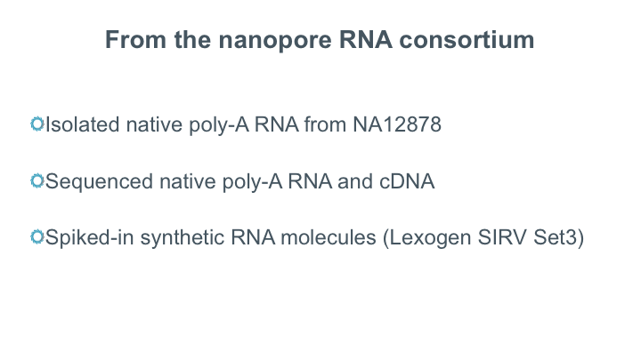
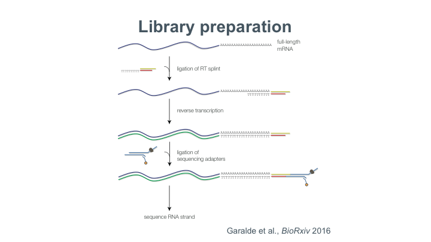
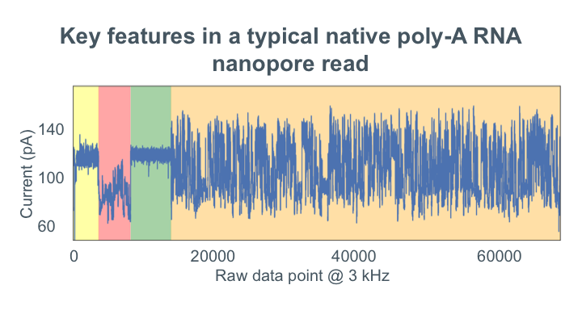
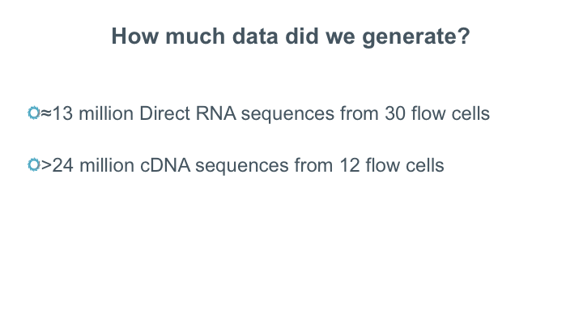
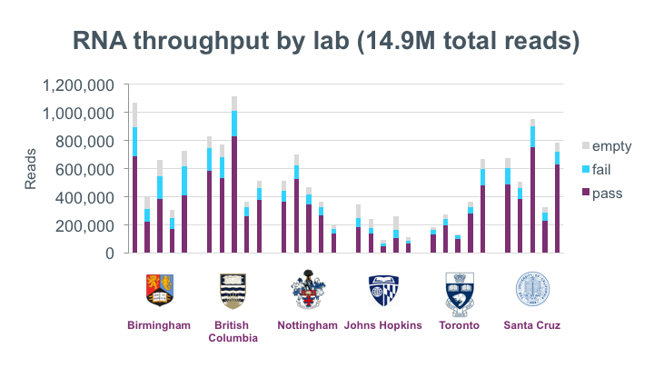
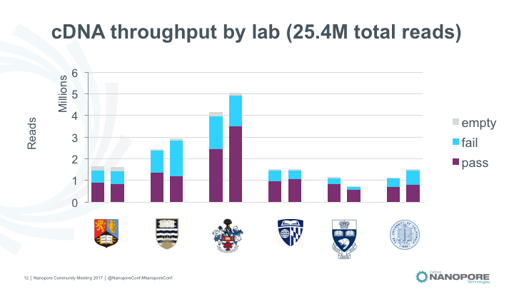
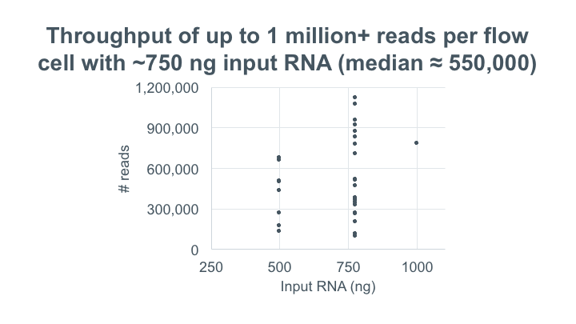
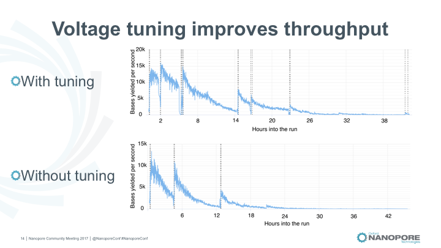
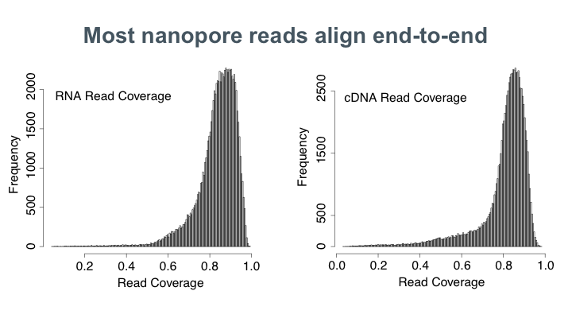
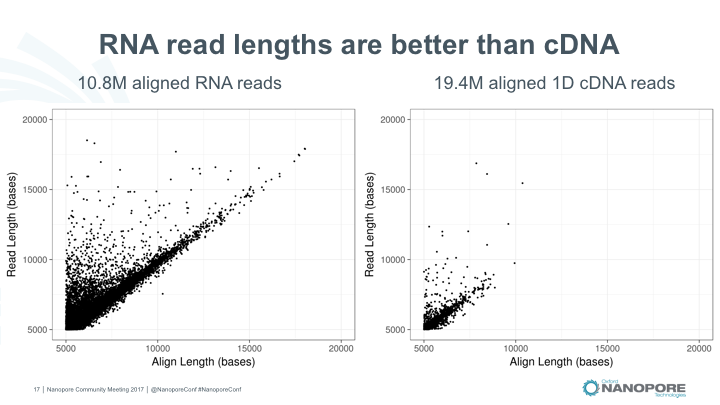
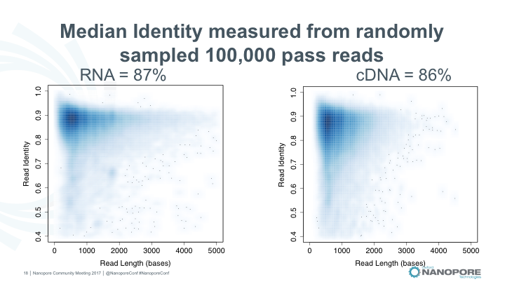
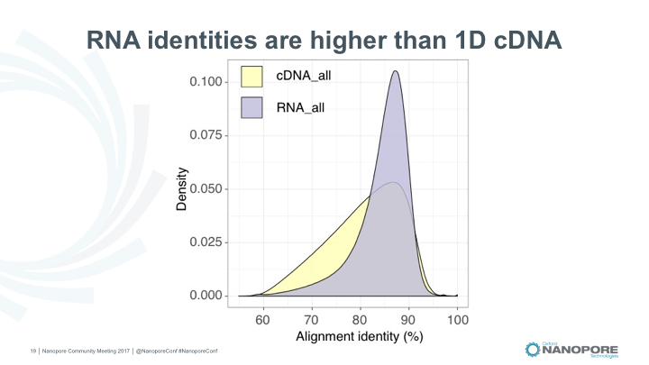
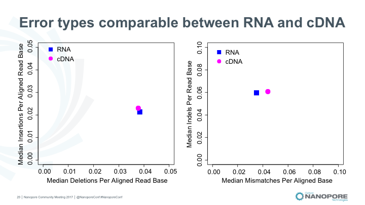
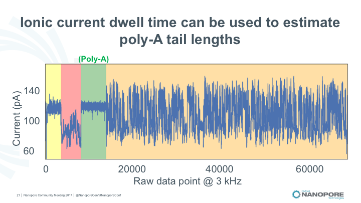
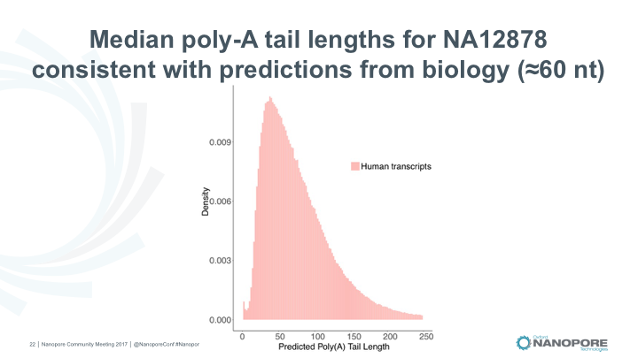

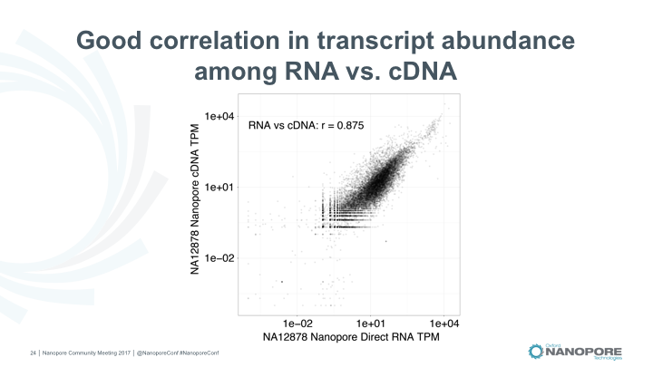
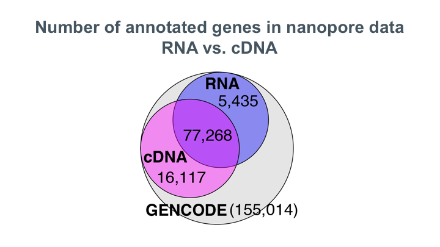

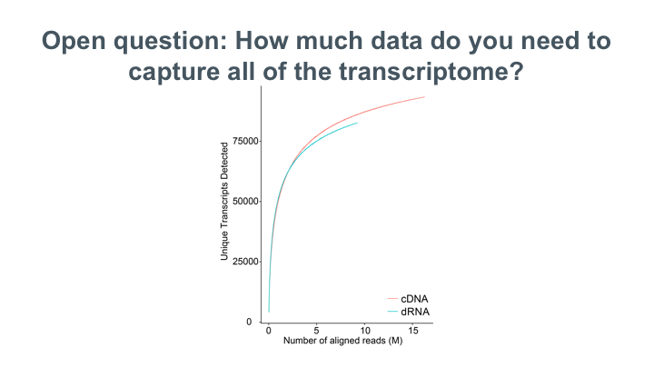
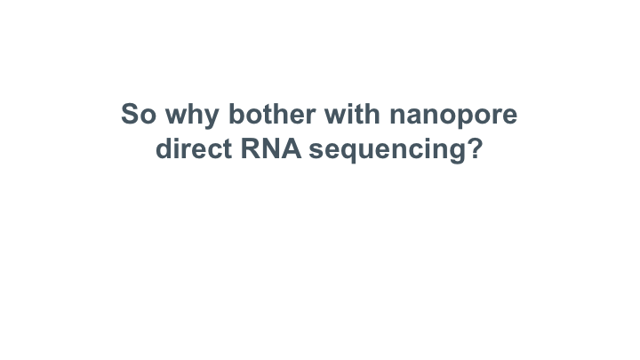
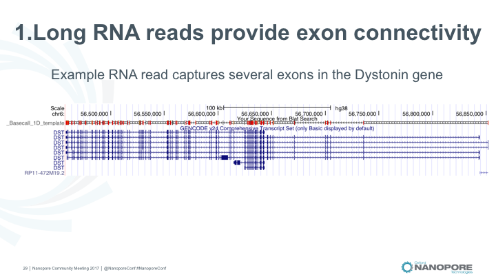
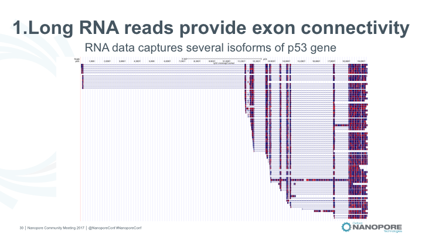

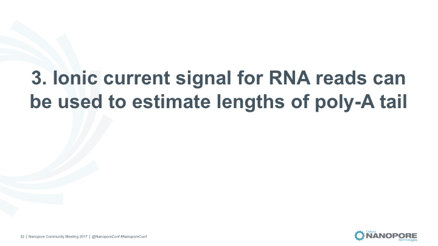
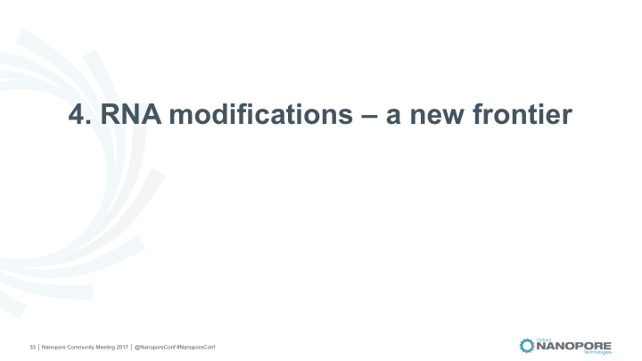
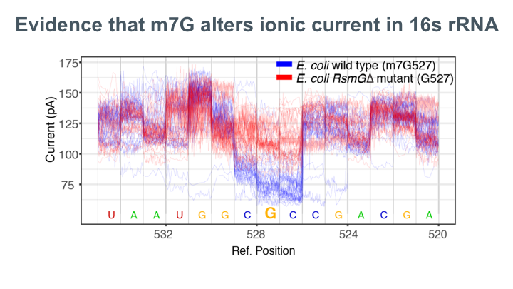
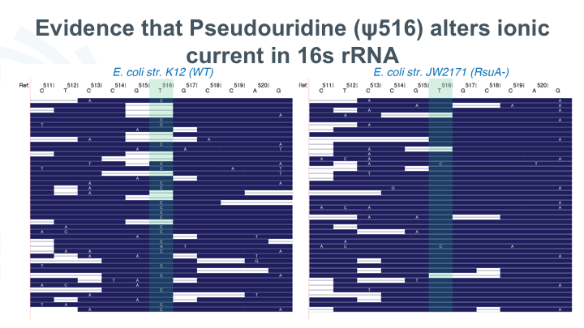
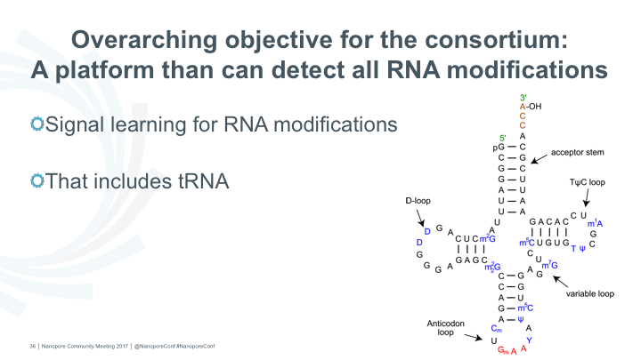
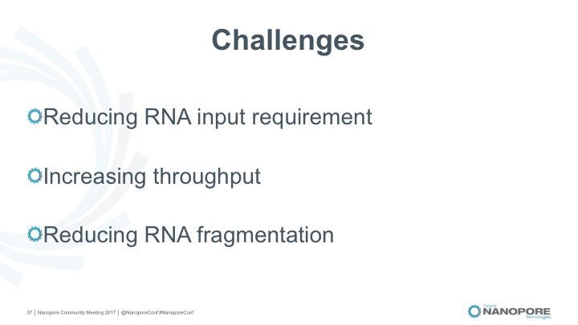
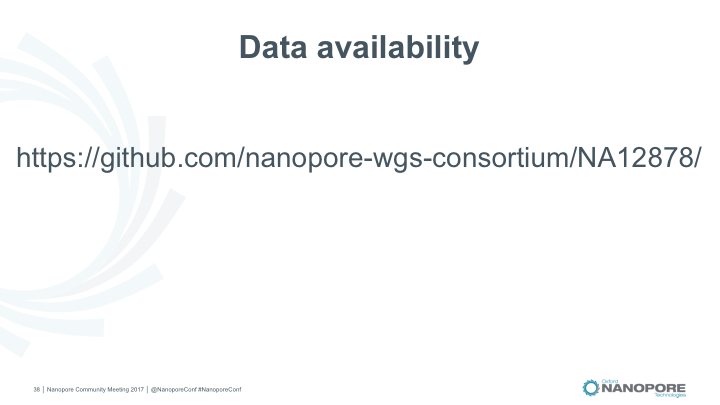
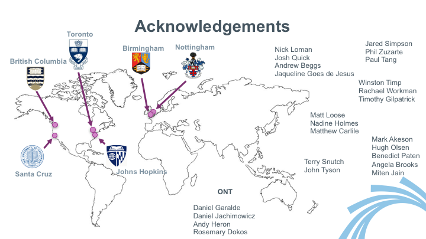

## Basecalls (Albacore 2.1)

### Direct RNA (full dataset, 30 runs)

   - [Pass](http://s3.amazonaws.com/nanopore-human-wgs/rna/fastq/NA12878-DirectRNA.pass.dedup.fastq.gz), 10302647 reads, mean 1030.24, N50 1334
   - [Fail](http://s3.amazonaws.com/nanopore-human-wgs/rna/fastq/NA12878-DirectRNA.fail.dedup.fastq.gz), 2686736 reads, mean 430.96, N50 840

### cDNA 1D (full dataset, 12 runs)

   - [Pass](http://s3.amazonaws.com/nanopore-human-wgs/rna/fastq/NA12878-cDNA-1D.pass.dedup.fastq), 15152101 reads, mean 932.86, N50 1072
   - [Fail](http://s3.amazonaws.com/nanopore-human-wgs/rna/fastq/NA12878-cDNA-1D.fail.dedup.fastq), 9129338 reads, mean 661.90, N50 841

### Combined Albacore Summary

   - [Summary File (gzip)](http://s3.amazonaws.com/nanopore-human-wgs/rna/summaries/NA12878-DirectRNA-cDNA-summary.dedup.txt.gz)

## Raw Signal Data

### Direct RNA

All runs MinION unless noted.

  - [Bham Run1](http://s3.amazonaws.com/nanopore-human-wgs/rna/links/Bham_Run1_20171009_DirectRNA.files.txt)
  - [Bham Run2](http://s3.amazonaws.com/nanopore-human-wgs/rna/links/Bham_Run2_20171011_DirectRNA.files.txt) (GridION)
  - [Bham Run3](http://s3.amazonaws.com/nanopore-human-wgs/rna/links/Bham_Run3_20171011_directRNA.files.txt) (GridION)
  - [Bham Run4](http://s3.amazonaws.com/nanopore-human-wgs/rna/links/Bham_Run4_20171011_directRNA.files.txt) (GridION)
  - [Bham Run5](http://s3.amazonaws.com/nanopore-human-wgs/rna/links/Bham_Run5_20171011_directRNA.files.txt) (GridION)
  - [Hopkins Run1](http://s3.amazonaws.com/nanopore-human-wgs/rna/links/Hopkins_Run1_20170928_DirectRNA.files.txt)
  - [Hopkins Run2](http://s3.amazonaws.com/nanopore-human-wgs/rna/links/Hopkins_Run2_20170928_DirectRNA.files.txt)
  - [Hopkins Run3](http://s3.amazonaws.com/nanopore-human-wgs/rna/links/Hopkins_Run3_20171003_DirectRNA.files.txt)
  - [Hopkins Run4](http://s3.amazonaws.com/nanopore-human-wgs/rna/links/Hopkins_Run4_20171003_DirectRNA.files.txt)
  - [Hopkins Run5](http://s3.amazonaws.com/nanopore-human-wgs/rna/links/Hopkins_Run5_20171003_DirectRNA.files.txt)
  - [Notts_Run1](http://s3.amazonaws.com/nanopore-human-wgs/rna/links/Notts_Run1_20171025_DirectRNA.files.txt)
  - [Notts_Run2](http://s3.amazonaws.com/nanopore-human-wgs/rna/links/Notts_Run2_20171027_DirectRNA.files.txt)
  - [Notts_Run3](http://s3.amazonaws.com/nanopore-human-wgs/rna/links/Notts_Run3_20171027_DirectRNA.files.txt)
  - [Notts Run4](http://s3.amazonaws.com/nanopore-human-wgs/rna/links/Notts_Run4_20171030_DirectRNA.files.txt)
  - [Notts_Run5](http://s3.amazonaws.com/nanopore-human-wgs/rna/links/Notts_Run5_20171030_DirectRNA.files.txt)
  - [OICR Run1](http://s3.amazonaws.com/nanopore-human-wgs/rna/links/OICR_Run1_20171006_DirectRNA.files.txt)
  - [OICR Run2](http://s3.amazonaws.com/nanopore-human-wgs/rna/links/OICR_Run2_20171010_DirectRNA.files.txt)
  - [OICR Run3](http://s3.amazonaws.com/nanopore-human-wgs/rna/links/OICR_Run3_20171013_DirectRNA.files.txt)
  - [OICR Run4](http://s3.amazonaws.com/nanopore-human-wgs/rna/links/OICR_Run4_20171030_DirectRNA.files.txt)
  - [OICR Run5](http://s3.amazonaws.com/nanopore-human-wgs/rna/links/OICR_Run5_20171101_DirectRNA.files.txt)
  - [UBC Run1](http://s3.amazonaws.com/nanopore-human-wgs/rna/links/UBC_Run1_20170907_DirectRNA.files.txt)
  - [UBC Run2](http://s3.amazonaws.com/nanopore-human-wgs/rna/links/UBC_Run2_20170908_DirectRNA.files.txt)
  - [UBC Run3](http://s3.amazonaws.com/nanopore-human-wgs/rna/links/UBC_Run3_20170911_DirectRNA.files.txt)
  - [UBC Run4](http://s3.amazonaws.com/nanopore-human-wgs/rna/links/UBC_Run4_20170920_DirectRNA.files.txt)
  - [UBC_Run5](http://s3.amazonaws.com/nanopore-human-wgs/rna/links/UBC_Run5_20171031_DirectRNA.files.txt)
  - [UCSC Run1](http://s3.amazonaws.com/nanopore-human-wgs/rna/links/UCSC_Run1_20170907_DirectRNA.files.txt)
  - [UCSC Run2](http://s3.amazonaws.com/nanopore-human-wgs/rna/links/UCSC_Run2_20170909_DirectRNA.files.txt)
  - [UCSC Run3](http://s3.amazonaws.com/nanopore-human-wgs/rna/links/UCSC_Run3_20170912_DirectRNA.files.txt)
  - [UCSC Run4](http://s3.amazonaws.com/nanopore-human-wgs/rna/links/UCSC_Run4_20170913_DirectRNA.files.txt)
  - [UCSC Run5](http://s3.amazonaws.com/nanopore-human-wgs/rna/links/UCSC_Run5_20170922_DirectRNA.files.txt)

## Alignment Files

All alignments performed using minimap2.

### Direct RNA

#### pass

   - [SIRVome BAM](http://s3.amazonaws.com/nanopore-human-wgs/rna/bamFiles/NA12878-DirectRNA.pass.dedup.NoU.fastq.SIRVome.minimap2.sorted.bam), [SIRVome BAI](http://s3.amazonaws.com/nanopore-human-wgs/rna/bamFiles/NA12878-DirectRNA.pass.dedup.NoU.fastq.SIRVome.minimap2.sorted.bam.bai)
   - [cDNA Abinitio BAM](http://s3.amazonaws.com/nanopore-human-wgs/rna/bamFiles/NA12878-DirectRNA.pass.dedup.NoU.fastq.ensembl_cdna_abinitio.minimap2.sorted.bam), [cDNA ab initio BAI](http://s3.amazonaws.com/nanopore-human-wgs/rna/bamFiles/NA12878-DirectRNA.pass.dedup.NoU.fastq.ensembl_cdna_abinitio.minimap2.sorted.bam.bai)
   - [Ensembl cDNA BAM](http://s3.amazonaws.com/nanopore-human-wgs/rna/bamFiles/NA12878-DirectRNA.pass.dedup.NoU.fastq.ensembl_cdna_all.minimap2.sorted.bam), [Ensembl cDNA BAI](http://s3.amazonaws.com/nanopore-human-wgs/rna/bamFiles/NA12878-DirectRNA.pass.dedup.NoU.fastq.ensembl_cdna_all.minimap2.sorted.bam.bai)
   - [Ensembl CDS BAM](http://s3.amazonaws.com/nanopore-human-wgs/rna/bamFiles/NA12878-DirectRNA.pass.dedup.NoU.fastq.ensembl_cds.minimap2.sorted.bam), [Ensembl CDS BAI](http://s3.amazonaws.com/nanopore-human-wgs/rna/bamFiles/NA12878-DirectRNA.pass.dedup.NoU.fastq.ensembl_cds.minimap2.sorted.bam.bai)
   - [Ensembl ncRNA BAM](http://s3.amazonaws.com/nanopore-human-wgs/rna/bamFiles/NA12878-DirectRNA.pass.dedup.NoU.fastq.ensembl_ncrna.minimap2.sorted.bam), [Ensembl ncRNA BAI](http://s3.amazonaws.com/nanopore-human-wgs/rna/bamFiles/NA12878-DirectRNA.pass.dedup.NoU.fastq.ensembl_ncrna.minimap2.sorted.bam.bai)
   - [Genbank RNA BAM](http://s3.amazonaws.com/nanopore-human-wgs/rna/bamFiles/NA12878-DirectRNA.pass.dedup.NoU.fastq.genbank_rna.minimap2.sorted.bam), [Genbank RNA BAI](http://s3.amazonaws.com/nanopore-human-wgs/rna/bamFiles/NA12878-DirectRNA.pass.dedup.NoU.fastq.genbank_rna.minimap2.sorted.bam.bai)
   - [hg38 BAM](http://s3.amazonaws.com/nanopore-human-wgs/rna/bamFiles/NA12878-DirectRNA.pass.dedup.NoU.fastq.hg38.minimap2.sorted.bam), [hg38 BAI](http://s3.amazonaws.com/nanopore-human-wgs/rna/bamFiles/NA12878-DirectRNA.pass.dedup.NoU.fastq.hg38.minimap2.sorted.bam.bai)

#### fail

   - [SIRVome BAM](http://s3.amazonaws.com/nanopore-human-wgs/rna/bamFiles/NA12878-DirectRNA.fail.dedup.NoU.fastq.SIRVome.minimap2.sorted.bam), [SIRVome BAI](http://s3.amazonaws.com/nanopore-human-wgs/rna/bamFiles/NA12878-DirectRNA.fail.dedup.NoU.fastq.SIRVome.minimap2.sorted.bam.bai)
   - [cDNA ab initio BAM](http://s3.amazonaws.com/nanopore-human-wgs/rna/bamFiles/NA12878-DirectRNA.fail.dedup.NoU.fastq.ensembl_cdna_abinitio.minimap2.sorted.bam), [cDNA ab initio BAI](http://s3.amazonaws.com/nanopore-human-wgs/rna/bamFiles/NA12878-DirectRNA.fail.dedup.NoU.fastq.ensembl_cdna_abinitio.minimap2.sorted.bam.bai)
   - [Ensembl cDNA BAM](http://s3.amazonaws.com/nanopore-human-wgs/rna/bamFiles/NA12878-DirectRNA.fail.dedup.NoU.fastq.ensembl_cdna_all.minimap2.sorted.bam), [Ensembl cDNA BAI](http://s3.amazonaws.com/nanopore-human-wgs/rna/bamFiles/NA12878-DirectRNA.fail.dedup.NoU.fastq.ensembl_cdna_all.minimap2.sorted.bam.bai)
   - [Ensembl CDS BAM](http://s3.amazonaws.com/nanopore-human-wgs/rna/bamFiles/NA12878-DirectRNA.fail.dedup.NoU.fastq.ensembl_cds.minimap2.sorted.bam), [Ensembl CDS BAI](http://s3.amazonaws.com/nanopore-human-wgs/rna/bamFiles/NA12878-DirectRNA.fail.dedup.NoU.fastq.ensembl_cds.minimap2.sorted.bam.bai)
   - [Ensembl ncRNA BAM](http://s3.amazonaws.com/nanopore-human-wgs/rna/bamFiles/NA12878-DirectRNA.fail.dedup.NoU.fastq.ensembl_ncrna.minimap2.sorted.bam), [Ensembl ncRNA BAI](http://s3.amazonaws.com/nanopore-human-wgs/rna/bamFiles/NA12878-DirectRNA.fail.dedup.NoU.fastq.ensembl_ncrna.minimap2.sorted.bam.bai)
   - [Genbank RNA BAM](http://s3.amazonaws.com/nanopore-human-wgs/rna/bamFiles/NA12878-DirectRNA.fail.dedup.NoU.fastq.genbank_rna.minimap2.sorted.bam), [Genbank RNA BAI](http://s3.amazonaws.com/nanopore-human-wgs/rna/bamFiles/NA12878-DirectRNA.fail.dedup.NoU.fastq.genbank_rna.minimap2.sorted.bam.bai)
   - [hg38 BAM](http://s3.amazonaws.com/nanopore-human-wgs/rna/bamFiles/NA12878-DirectRNA.fail.dedup.NoU.fastq.hg38.minimap2.sorted.bam), [hg38 BAI](http://s3.amazonaws.com/nanopore-human-wgs/rna/bamFiles/NA12878-DirectRNA.fail.dedup.NoU.fastq.hg38.minimap2.sorted.bam.bai)

## Reference Files

   - [GRCh38 ab initio](http://s3.amazonaws.com/nanopore-human-wgs/rna/referenceFastaFiles/cdna/Homo_sapiens.GRCh38.cdna.abinitio.fa)
   - [GRCh38 cDNA](http://s3.amazonaws.com/nanopore-human-wgs/rna/referenceFastaFiles/cdna/Homo_sapiens.GRCh38.cdna.all.fa)
   - [cDNA README](http://s3.amazonaws.com/nanopore-human-wgs/rna/referenceFastaFiles/cdna/cdna_README)
   - [GRCh38 CDS](http://s3.amazonaws.com/nanopore-human-wgs/rna/referenceFastaFiles/cds/Homo_sapiens.GRCh38.cds.all.fa)
   - [CDS README](http://s3.amazonaws.com/nanopore-human-wgs/rna/referenceFastaFiles/cds/cds_README)
   - [GRCh38 FASTA](http://s3.amazonaws.com/nanopore-human-wgs/rna/referenceFastaFiles/dna/GRCh38_full_analysis_set_plus_decoy_hla-extra.fa)
   - [GRCh38 dict](http://s3.amazonaws.com/nanopore-human-wgs/rna/referenceFastaFiles/dna/GRCh38_full_analysis_set_plus_decoy_hla.dict)

### GRC38 and BWA indices

   - [GRCh38 full analysis set plus decoy hla](http://s3.amazonaws.com/nanopore-human-wgs/rna/referenceFastaFiles/dna/GRCh38_full_analysis_set_plus_decoy_hla.fa)
   - [GRCh38 full analysis set plus decoy hla.alt](http://s3.amazonaws.com/nanopore-human-wgs/rna/referenceFastaFiles/dna/GRCh38_full_analysis_set_plus_decoy_hla.fa.alt)
   - [GRCh38 full analysis set plus decoy hla.amb](http://s3.amazonaws.com/nanopore-human-wgs/rna/referenceFastaFiles/dna/GRCh38_full_analysis_set_plus_decoy_hla.fa.amb)
   - [GRCh38 full analysis set plus decoy hla.ann](http://s3.amazonaws.com/nanopore-human-wgs/rna/referenceFastaFiles/dna/GRCh38_full_analysis_set_plus_decoy_hla.fa.ann)
   - [GRCh38 full analysis set plus decoy hla.bwt](http://s3.amazonaws.com/nanopore-human-wgs/rna/referenceFastaFiles/dna/GRCh38_full_analysis_set_plus_decoy_hla.fa.bwt)
   - [GRCh38 full analysis set plus decoy hla.fai](http://s3.amazonaws.com/nanopore-human-wgs/rna/referenceFastaFiles/dna/GRCh38_full_analysis_set_plus_decoy_hla.fa.fai)
   - [GRCh38 full analysis set plus decoy hla.pac](http://s3.amazonaws.com/nanopore-human-wgs/rna/referenceFastaFiles/dna/GRCh38_full_analysis_set_plus_decoy_hla.fa.pac)
   - [GRCh38 full analysis set plus decoy hla.sai](http://s3.amazonaws.com/nanopore-human-wgs/rna/referenceFastaFiles/dna/GRCh38_full_analysis_set_plus_decoy_hla.fa.sa)
   - [GRCh38 latest genomic.gff](http://s3.amazonaws.com/nanopore-human-wgs/rna/referenceFastaFiles/genbank/GRCh38_latest_genomic.gff)
   - [Homo_sapiens.GRCh38.90.abinitio.gtf](http://s3.amazonaws.com/nanopore-human-wgs/rna/referenceFastaFiles/gtf/Homo_sapiens.GRCh38.90.abinitio.gtf)
   - [Homo_sapiens.GRCh38.90.chr.gtf](http://s3.amazonaws.com/nanopore-human-wgs/rna/referenceFastaFiles/gtf/Homo_sapiens.GRCh38.90.chr.gtf)
   - [Homo_sapiens.GRCh38.90.chr_patch_hapl_scaff.gtf](http://s3.amazonaws.com/nanopore-human-wgs/rna/referenceFastaFiles/gtf/Homo_sapiens.GRCh38.90.chr_patch_hapl_scaff.gtf)
   - [Homo_sapiens.GRCh38.90.gtf](http://s3.amazonaws.com/nanopore-human-wgs/rna/referenceFastaFiles/gtf/Homo_sapiens.GRCh38.90.gtf)
   - [gtf_README](http://s3.amazonaws.com/nanopore-human-wgs/rna/referenceFastaFiles/gtf/gtf_README)

### SIRVome

   - [SIRVome isoforms ERCCs 170612a.fasta](http://s3.amazonaws.com/nanopore-human-wgs/rna/referenceFastaFiles/sirv/SIRVome_isoforms_ERCCs_170612a.fasta)
   - [SIRVome isoforms ERCCs Lot001485 C 170612a.gtf](http://s3.amazonaws.com/nanopore-human-wgs/rna/referenceFastaFiles/sirv/SIRVome_isoforms_ERCCs_Lot001485_C_170612a.gtf)
   - [SIRVome isoforms ERCCs Lot001485 I 170612a.gtf](http://s3.amazonaws.com/nanopore-human-wgs/rna/referenceFastaFiles/sirv/SIRVome_isoforms_ERCCs_Lot001485_I_170612a.gtf)
   - [SIRVome isoforms ERCCs Lot001485 O 170612a.gtf](http://s3.amazonaws.com/nanopore-human-wgs/rna/referenceFastaFiles/sirv/SIRVome_isoforms_ERCCs_Lot001485_O_170612a.gtf)

### cDNA

   - [NA12878 cDNA 1D pass BAM](http://s3.amazonaws.com/nanopore-human-wgs/rna/bamFiles/NA12878-cDNA-1D.pass.dedup.fastq.genbank_rna.minimap2.sorted.bam), [NA12878-cDNA-1D.pass BAI](http://s3.amazonaws.com/nanopore-human-wgs/rna/bamFiles/NA12878-cDNA-1D.pass.dedup.fastq.genbank_rna.minimap2.sorted.bam.bai)
   - [NA12878 cDNA 1D fail BAM](http://s3.amazonaws.com/nanopore-human-wgs/rna/bamFiles/NA12878-cDNA-1D.fail.dedup.fastq.genbank_rna.minimap2.sorted.bam), [NA12878-cDNA-1D.fail BAI](http://s3.amazonaws.com/nanopore-human-wgs/rna/bamFiles/NA12878-cDNA-1D.fail.dedup.fastq.genbank_rna.minimap2.sorted.bam.bai)

### Run by run links

   - [1D2 Bham Run1 all 1D only FASTQ](https://s3.amazonaws.com/nanopore-human-wgs/rna/fastq/Bham_Run1_20171120_1D2.all.dedup.fastq)
   - [1D2 Bham Run2 all 1D only FASTQ](https://s3.amazonaws.com/nanopore-human-wgs/rna/fastq/Bham_Run2_20171120_1D2.all.dedup.fastq)
   - [1D2 Hopkins Run1 all 1D only FASTQ](https://s3.amazonaws.com/nanopore-human-wgs/rna/fastq/Hopkins_Run1_20171011_1D2.all.dedup.fastq)
   - [1D2 Hopkins Run2 all 1D only FASTQ](https://s3.amazonaws.com/nanopore-human-wgs/rna/fastq/Hopkins_Run2_20171011_1D2.all.dedup.fastq)
   - [1D2 Notts Run1 all 1D only FASTQ](https://s3.amazonaws.com/nanopore-human-wgs/rna/fastq/Notts_Run1_20171106_1D2.all.dedup.fastq)
   - [1D2 Notts Run2 all 1D only FASTQ](https://s3.amazonaws.com/nanopore-human-wgs/rna/fastq/Notts_Run2_20171108_1D2.all.dedup.fastq)
   - [1D2 OICR Run1 all 1D only FASTQ](https://s3.amazonaws.com/nanopore-human-wgs/rna/fastq/OICR_Run1_20171208_1D2.all.dedup.fastq)
   - [1D2 OICR Run2 all 1D only FASTQ](https://s3.amazonaws.com/nanopore-human-wgs/rna/fastq/OICR_Run2_20171208_1D2.all.dedup.fastq)
   - [1D2 UBC Run1 all 1D only FASTQ](https://s3.amazonaws.com/nanopore-human-wgs/rna/fastq/UBC_Run1_20170914_1D2.all.dedup.fastq)
   - [1D2 UBC Run2 all 1D only FASTQ](https://s3.amazonaws.com/nanopore-human-wgs/rna/fastq/UBC_Run2_20171109_1D2.all.dedup.fastq)
   - [1D2 UCSC Run1 all 1D only FASTQ](https://s3.amazonaws.com/nanopore-human-wgs/rna/fastq/UCSC_Run1_20170920_1D2.all.dedup.fastq)
   - [1D2 UCSC Run2 all 1D only FASTQ](https://s3.amazonaws.com/nanopore-human-wgs/rna/fastq/UCSC_Run2_20170926_1D2.all.dedup.fastq)
   - [1D Bham Run1 fail FASTQ](https://s3.amazonaws.com/nanopore-human-wgs/rna/fastq/Bham_Run1_20171115_1D.fail.dedup.fastq)
   - [1D Bham Run1 pass FASTQ](https://s3.amazonaws.com/nanopore-human-wgs/rna/fastq/Bham_Run1_20171115_1D.pass.dedup.fastq)
   - [1D Bham Run2 fail FASTQ](https://s3.amazonaws.com/nanopore-human-wgs/rna/fastq/Bham_Run2_20171115_1D.fail.dedup.fastq)
   - [1D Bham Run2 pass FASTQ](https://s3.amazonaws.com/nanopore-human-wgs/rna/fastq/Bham_Run2_20171115_1D.pass.dedup.fastq)
   - [1D Hopkins Run1 fail FASTQ](https://s3.amazonaws.com/nanopore-human-wgs/rna/fastq/Hopkins_Run1_20171011_1D.fail.dedup.fastq)
   - [1D Hopkins Run1 pass FASTQ](https://s3.amazonaws.com/nanopore-human-wgs/rna/fastq/Hopkins_Run1_20171011_1D.pass.dedup.fastq)
   - [1D Hopkins Run2 fail FASTQ](https://s3.amazonaws.com/nanopore-human-wgs/rna/fastq/Hopkins_Run2_20171011_1D.fail.dedup.fastq)
   - [1D Hopkins Run2 pass FASTQ](https://s3.amazonaws.com/nanopore-human-wgs/rna/fastq/Hopkins_Run2_20171011_1D.pass.dedup.fastq)
   - [1D Notts Run1 fail FASTQ](https://s3.amazonaws.com/nanopore-human-wgs/rna/fastq/Notts_Run1_20171106_1D.fail.dedup.fastq)
   - [1D Notts Run1 pass FASTQ](https://s3.amazonaws.com/nanopore-human-wgs/rna/fastq/Notts_Run1_20171106_1D.pass.dedup.fastq)
   - [1D Notts Run2 fail FASTQ](https://s3.amazonaws.com/nanopore-human-wgs/rna/fastq/Notts_Run2_20171108_1D.fail.dedup.fastq)
   - [1D Notts Run2 pass FASTQ](https://s3.amazonaws.com/nanopore-human-wgs/rna/fastq/Notts_Run2_20171108_1D.pass.dedup.fastq)
   - [1D OICR Run1 fail FASTQ](https://s3.amazonaws.com/nanopore-human-wgs/rna/fastq/OICR_Run1_20171117_1D.fail.dedup.fastq)
   - [1D OICR Run1 pass FASTQ](https://s3.amazonaws.com/nanopore-human-wgs/rna/fastq/OICR_Run1_20171117_1D.pass.dedup.fastq)
   - [1D OICR Run2 fail FASTQ](https://s3.amazonaws.com/nanopore-human-wgs/rna/fastq/OICR_Run2_20171121_1D.fail.dedup.fastq)
   - [1D OICR Run2 pass FASTQ](https://s3.amazonaws.com/nanopore-human-wgs/rna/fastq/OICR_Run2_20171121_1D.pass.dedup.fastq)
   - [1D UBC Run1 fail FASTQ](https://s3.amazonaws.com/nanopore-human-wgs/rna/fastq/UBC_Run1_20170913_1D.fail.dedup.fastq)
   - [1D UBC Run1 pass FASTQ](https://s3.amazonaws.com/nanopore-human-wgs/rna/fastq/UBC_Run1_20170913_1D.pass.dedup.fastq)
   - [1D UBC Run2 fail FASTQ](https://s3.amazonaws.com/nanopore-human-wgs/rna/fastq/UBC_Run2_20171020_1D.fail.dedup.fastq)
   - [1D UBC Run2 pass FASTQ](https://s3.amazonaws.com/nanopore-human-wgs/rna/fastq/UBC_Run2_20171020_1D.pass.dedup.fastq)
   - [1D UCSC Run1 fail FASTQ](https://s3.amazonaws.com/nanopore-human-wgs/rna/fastq/UCSC_Run1_20170919_1D.fail.dedup.fastq)
   - [1D UCSC Run1 pass FASTQ](https://s3.amazonaws.com/nanopore-human-wgs/rna/fastq/UCSC_Run1_20170919_1D.pass.dedup.fastq)
   - [1D UCSC Run2 fail FASTQ](https://s3.amazonaws.com/nanopore-human-wgs/rna/fastq/UCSC_Run2_20170922_1D.fail.dedup.fastq)
   - [1D UCSC Run2 pass FASTQ](https://s3.amazonaws.com/nanopore-human-wgs/rna/fastq/UCSC_Run2_20170922_1D.pass.dedup.fastq)
   - [DirectRNA Bham Run1 fail FASTQ](https://s3.amazonaws.com/nanopore-human-wgs/rna/fastq/Bham_Run1_20171009_DirectRNA.fail.dedup.fastq)
   - [DirectRNA Bham Run1 pass FASTQ](https://s3.amazonaws.com/nanopore-human-wgs/rna/fastq/Bham_Run1_20171009_DirectRNA.pass.dedup.fastq)
   - [DirectRNA Bham Run2 fail FASTQ](https://s3.amazonaws.com/nanopore-human-wgs/rna/fastq/Bham_Run2_20171011_DirectRNA.fail.dedup.fastq)
   - [DirectRNA Bham Run2 pass FASTQ](https://s3.amazonaws.com/nanopore-human-wgs/rna/fastq/Bham_Run2_20171011_DirectRNA.pass.dedup.fastq)
   - [DirectRNA Bham Run3 fail FASTQ](https://s3.amazonaws.com/nanopore-human-wgs/rna/fastq/Bham_Run3_20171011_DirectRNA.fail.dedup.fastq)
   - [DirectRNA Bham Run3 pass FASTQ](https://s3.amazonaws.com/nanopore-human-wgs/rna/fastq/Bham_Run3_20171011_DirectRNA.pass.dedup.fastq)
   - [DirectRNA Bham Run4 fail FASTQ](https://s3.amazonaws.com/nanopore-human-wgs/rna/fastq/Bham_Run4_20171011_DirectRNA.fail.dedup.fastq)
   - [DirectRNA Bham Run4 pass FASTQ](https://s3.amazonaws.com/nanopore-human-wgs/rna/fastq/Bham_Run4_20171011_DirectRNA.pass.dedup.fastq)
   - [DirectRNA Bham Run5 fail FASTQ](https://s3.amazonaws.com/nanopore-human-wgs/rna/fastq/Bham_Run5_20171011_DirectRNA.fail.dedup.fastq)
   - [DirectRNA Bham Run5 pass FASTQ](https://s3.amazonaws.com/nanopore-human-wgs/rna/fastq/Bham_Run5_20171011_DirectRNA.pass.dedup.fastq)
   - [DirectRNA Hopkins Run1 fail FASTQ](https://s3.amazonaws.com/nanopore-human-wgs/rna/fastq/Hopkins_Run1_20170928_DirectRNA.fail.dedup.fastq)
   - [DirectRNA Hopkins Run1 pass FASTQ](https://s3.amazonaws.com/nanopore-human-wgs/rna/fastq/Hopkins_Run1_20170928_DirectRNA.pass.dedup.fastq)
   - [DirectRNA Hopkins Run2 fail FASTQ](https://s3.amazonaws.com/nanopore-human-wgs/rna/fastq/Hopkins_Run2_20170928_DirectRNA.fail.dedup.fastq)
   - [DirectRNA Hopkins Run2 pass FASTQ](https://s3.amazonaws.com/nanopore-human-wgs/rna/fastq/Hopkins_Run2_20170928_DirectRNA.pass.dedup.fastq)
   - [DirectRNA Hopkins Run3 fail FASTQ](https://s3.amazonaws.com/nanopore-human-wgs/rna/fastq/Hopkins_Run3_20171003_DirectRNA.fail.dedup.fastq)
   - [DirectRNA Hopkins Run3 pass FASTQ](https://s3.amazonaws.com/nanopore-human-wgs/rna/fastq/Hopkins_Run3_20171003_DirectRNA.pass.dedup.fastq)
   - [DirectRNA Hopkins Run4 fail FASTQ](https://s3.amazonaws.com/nanopore-human-wgs/rna/fastq/Hopkins_Run4_20171003_DirectRNA.fail.dedup.fastq)
   - [DirectRNA Hopkins Run4 pass FASTQ](https://s3.amazonaws.com/nanopore-human-wgs/rna/fastq/Hopkins_Run4_20171003_DirectRNA.pass.dedup.fastq)
   - [DirectRNA Hopkins Run5 fail FASTQ](https://s3.amazonaws.com/nanopore-human-wgs/rna/fastq/Hopkins_Run5_20171003_DirectRNA.fail.dedup.fastq)
   - [DirectRNA Hopkins Run5 pass FASTQ](https://s3.amazonaws.com/nanopore-human-wgs/rna/fastq/Hopkins_Run5_20171003_DirectRNA.pass.dedup.fastq)
   - [DirectRNA Notts Run1 fail FASTQ](https://s3.amazonaws.com/nanopore-human-wgs/rna/fastq/Notts_Run1_20171025_DirectRNA.fail.dedup.fastq)
   - [DirectRNA Notts Run1 pass FASTQ](https://s3.amazonaws.com/nanopore-human-wgs/rna/fastq/Notts_Run1_20171025_DirectRNA.pass.dedup.fastq)
   - [DirectRNA Notts Run2 fail FASTQ](https://s3.amazonaws.com/nanopore-human-wgs/rna/fastq/Notts_Run2_20171027_DirectRNA.fail.dedup.fastq)
   - [DirectRNA Notts Run2 pass FASTQ](https://s3.amazonaws.com/nanopore-human-wgs/rna/fastq/Notts_Run2_20171027_DirectRNA.pass.dedup.fastq)
   - [DirectRNA Notts Run3 fail FASTQ](https://s3.amazonaws.com/nanopore-human-wgs/rna/fastq/Notts_Run3_20171027_DirectRNA.fail.dedup.fastq)
   - [DirectRNA Notts Run3 pass FASTQ](https://s3.amazonaws.com/nanopore-human-wgs/rna/fastq/Notts_Run3_20171027_DirectRNA.pass.dedup.fastq)
   - [DirectRNA Notts Run4 fail FASTQ](https://s3.amazonaws.com/nanopore-human-wgs/rna/fastq/Notts_Run4_20171030_DirectRNA.fail.dedup.fastq)
   - [DirectRNA Notts Run4 pass FASTQ](https://s3.amazonaws.com/nanopore-human-wgs/rna/fastq/Notts_Run4_20171030_DirectRNA.pass.dedup.fastq)
   - [DirectRNA Notts Run5 fail FASTQ](https://s3.amazonaws.com/nanopore-human-wgs/rna/fastq/Notts_Run5_20171030_DirectRNA.fail.dedup.fastq)
   - [DirectRNA Notts Run5 pass FASTQ](https://s3.amazonaws.com/nanopore-human-wgs/rna/fastq/Notts_Run5_20171030_DirectRNA.pass.dedup.fastq)
   - [DirectRNA OICR Run1 fail FASTQ](https://s3.amazonaws.com/nanopore-human-wgs/rna/fastq/OICR_Run1_20171006_DirectRNA.fail.dedup.fastq)
   - [DirectRNA OICR Run1 pass FASTQ](https://s3.amazonaws.com/nanopore-human-wgs/rna/fastq/OICR_Run1_20171006_DirectRNA.pass.dedup.fastq)
   - [DirectRNA OICR Run2 fail FASTQ](https://s3.amazonaws.com/nanopore-human-wgs/rna/fastq/OICR_Run2_20171010_DirectRNA.fail.dedup.fastq)
   - [DirectRNA OICR Run2 pass FASTQ](https://s3.amazonaws.com/nanopore-human-wgs/rna/fastq/OICR_Run2_20171010_DirectRNA.pass.dedup.fastq)
   - [DirectRNA OICR Run3 fail FASTQ](https://s3.amazonaws.com/nanopore-human-wgs/rna/fastq/OICR_Run3_20171013_DirectRNA.fail.dedup.fastq)
   - [DirectRNA OICR Run3 pass FASTQ](https://s3.amazonaws.com/nanopore-human-wgs/rna/fastq/OICR_Run3_20171013_DirectRNA.pass.dedup.fastq)
   - [DirectRNA OICR Run4 fail FASTQ](https://s3.amazonaws.com/nanopore-human-wgs/rna/fastq/OICR_Run4_20171030_DirectRNA.fail.dedup.fastq)
   - [DirectRNA OICR Run4 pass FASTQ](https://s3.amazonaws.com/nanopore-human-wgs/rna/fastq/OICR_Run4_20171030_DirectRNA.pass.dedup.fastq)
   - [DirectRNA OICR Run5 fail FASTQ](https://s3.amazonaws.com/nanopore-human-wgs/rna/fastq/OICR_Run5_20171101_DirectRNA.fail.dedup.fastq)
   - [DirectRNA OICR Run5 pass FASTQ](https://s3.amazonaws.com/nanopore-human-wgs/rna/fastq/OICR_Run5_20171101_DirectRNA.pass.dedup.fastq)
   - [DirectRNA UBC Run1 fail FASTQ](https://s3.amazonaws.com/nanopore-human-wgs/rna/fastq/UBC_Run1_20170907_DirectRNA.fail.dedup.fastq)
   - [DirectRNA UBC Run1 pass FASTQ](https://s3.amazonaws.com/nanopore-human-wgs/rna/fastq/UBC_Run1_20170907_DirectRNA.pass.dedup.fastq)
   - [DirectRNA UBC Run2 fail FASTQ](https://s3.amazonaws.com/nanopore-human-wgs/rna/fastq/UBC_Run2_20170908_DirectRNA.fail.dedup.fastq)
   - [DirectRNA UBC Run2 pass FASTQ](https://s3.amazonaws.com/nanopore-human-wgs/rna/fastq/UBC_Run2_20170908_DirectRNA.pass.dedup.fastq)
   - [DirectRNA UBC Run3 fail FASTQ](https://s3.amazonaws.com/nanopore-human-wgs/rna/fastq/UBC_Run3_20170911_DirectRNA.fail.dedup.fastq)
   - [DirectRNA UBC Run3 pass FASTQ](https://s3.amazonaws.com/nanopore-human-wgs/rna/fastq/UBC_Run3_20170911_DirectRNA.pass.dedup.fastq)
   - [DirectRNA UBC Run4 fail FASTQ](https://s3.amazonaws.com/nanopore-human-wgs/rna/fastq/UBC_Run4_20170920_DirectRNA.fail.dedup.fastq)
   - [DirectRNA UBC Run4 pass FASTQ](https://s3.amazonaws.com/nanopore-human-wgs/rna/fastq/UBC_Run4_20170920_DirectRNA.pass.dedup.fastq)
   - [DirectRNA UBC Run5 fail FASTQ](https://s3.amazonaws.com/nanopore-human-wgs/rna/fastq/UBC_Run5_20171031_DirectRNA.fail.dedup.fastq)
   - [DirectRNA UBC Run5 pass FASTQ](https://s3.amazonaws.com/nanopore-human-wgs/rna/fastq/UBC_Run5_20171031_DirectRNA.pass.dedup.fastq)
   - [DirectRNA UCSC Run1 fail FASTQ](https://s3.amazonaws.com/nanopore-human-wgs/rna/fastq/UCSC_Run1_20170907_DirectRNA.fail.dedup.fastq)
   - [DirectRNA UCSC Run1 pass FASTQ](https://s3.amazonaws.com/nanopore-human-wgs/rna/fastq/UCSC_Run1_20170907_DirectRNA.pass.dedup.fastq)
   - [DirectRNA UCSC Run2 fail FASTQ](https://s3.amazonaws.com/nanopore-human-wgs/rna/fastq/UCSC_Run2_20170909_DirectRNA.fail.dedup.fastq)
   - [DirectRNA UCSC Run2 pass FASTQ](https://s3.amazonaws.com/nanopore-human-wgs/rna/fastq/UCSC_Run2_20170909_DirectRNA.pass.dedup.fastq)
   - [DirectRNA UCSC Run3 fail FASTQ](https://s3.amazonaws.com/nanopore-human-wgs/rna/fastq/UCSC_Run3_20170912_DirectRNA.fail.dedup.fastq)
   - [DirectRNA UCSC Run3 pass FASTQ](https://s3.amazonaws.com/nanopore-human-wgs/rna/fastq/UCSC_Run3_20170912_DirectRNA.pass.dedup.fastq)
   - [DirectRNA UCSC Run4 fail FASTQ](https://s3.amazonaws.com/nanopore-human-wgs/rna/fastq/UCSC_Run4_20170913_DirectRNA.fail.dedup.fastq)
   - [DirectRNA UCSC Run4 pass FASTQ](https://s3.amazonaws.com/nanopore-human-wgs/rna/fastq/UCSC_Run4_20170913_DirectRNA.pass.dedup.fastq)
   - [DirectRNA UCSC Run5 fail FASTQ](https://s3.amazonaws.com/nanopore-human-wgs/rna/fastq/UCSC_Run5_20170922_DirectRNA.fail.dedup.fastq)
   - [DirectRNA UCSC Run5 pass FASTQ](https://s3.amazonaws.com/nanopore-human-wgs/rna/fastq/UCSC_Run5_20170922_DirectRNA.pass.dedup.fastq)

## External Links

Heng Li has make a [custom track for the UCSC genome browser](http://genome.ucsc.edu/cgi-bin/hgTracks?db=hg38&position=chr6:43,767,094-43,788,458&hgct_customText=track%20type%3DbigBed%20name%3DNA12878-DirectRNA.minimap2-2.5%20useScore%3D1%20visibility%3D4%20itemRgb%3D%22On%22%20bigDataUrl%3Dhttps%3A%2F%2Ffiles.osf.io%2Fv1%2Fresources%2Fb5nm2%2Fproviders%2Fosfstorage%2F5a2347599ad5a10272ed5739%3Faction%3Ddownload%26version%3D1%26direct) from the direct RNA dataset. Thanks Heng!  [1]

## References

[1] Li, H  Twitter [link](https://twitter.com/lh3lh3/status/937166309414064129)

   

   
   
