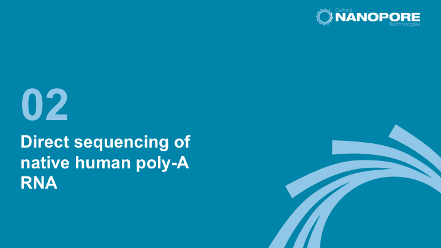
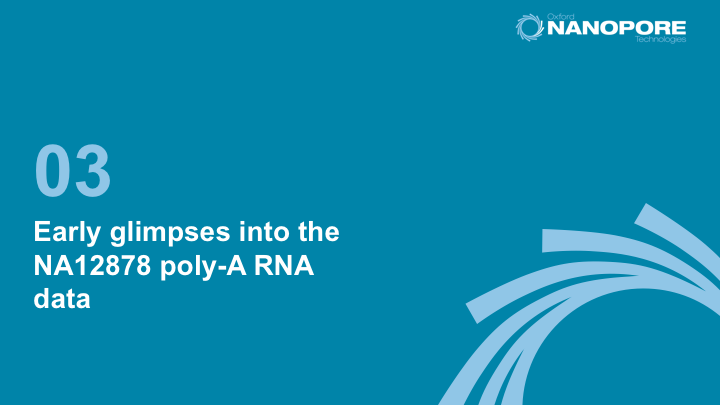

# RNA and cDNA Sequencing on Oxford Nanopore MinION and GridION

## Introduction

We have sequenced the CEPH1463 (NA12878/GM12878, Ceph/Utah pedigree) human genome reference standard on the Oxford Nanopore MinION using direct RNA sequencing kits (30 flowcells) and using the 1D ligation kit (SQK-LSK108) on R9.4 flowcells using R9.4 chemistry (FLO-MIN106). RNA from the GM12878 human cell line (Ceph/Utah pedigree) was extracted from the cultured cell line.

## Contributors

 - Winston Timp, Rachael Workman, Timothy Gilpatrick (_Johns Hopkins_)
 - Jared Simpson, Phil Zuzarte, Paul Tang (_OICR_)
 - Terry Snutch, John Tyson (_UBC_)
 - Mark Akeson, Hugh Olsen, Benedict Paten, Angela Brooks, Miten Jain (_UCSC_)
 - Nick Loman, Josh Quick, Andrew Beggs, Jaqueline Goes de Jesus (_University of Birmingham_)
 - Matt Loose, Nadine Holmes, Matthew Carlile (_University of Nottingham_)

## Acknowledgements

We are most grateful to Daniel Garalde, Daniel Jachimowicz, Andy Heron, Rosemary Dokos at Oxford Nanopore Technologies for technical and logistical assistance.

## Analysis

## Basecalls (Albacore 2.1)

### Direct RNA (full dataset, 30 runs)

   - [Pass](http://s3.amazonaws.com/nanopore-human-wgs/rna/fastq/NA12878-DirectRNA.pass.dedup.fastq), 10302647 reads, mean 1030.24, N50 1334
   - [Fail](http://s3.amazonaws.com/nanopore-human-wgs/rna/fastq/NA12878-DirectRNA.fail.dedup.fastq), 2686736 reads, mean 430.96, N50 840

### cDNA 1D (full dataset, 12 runs)

   - [Pass](http://s3.amazonaws.com/nanopore-human-wgs/rna/fastq/NA12878-cDNA-1D.pass.dedup.fastq), 15152101 reads, mean 932.86, N50 1072
   - [Fail](http://s3.amazonaws.com/nanopore-human-wgs/rna/fastq/NA12878-cDNA-1D.fail.dedup.fastq), 9129338 reads, mean 661.90, N50 841
   - [Summary stats](http://s3.amazonaws.com/nanopore-human-wgs/rna/summaries/NA12878-cDNA.summary.dedup.txt.gz)

## Alignment Files

All alignments performed using minimap2.

### Direct RNA

#### pass

   - [SIRVome BAM](http://s3.amazonaws.com/nanopore-human-wgs-rna/bamFiles/NA.pass.dedup.NoU.fastq.SIRVome.minimap2.sorted.bam), [SIRVome BAI] (http://s3.amazonaws.com/nanopore-human-wgs-rna/bamFiles/NA.pass.dedup.NoU.fastq.SIRVome.minimap2.sorted.bam.bai)
   - [cDNA Abinitio BAM](http://s3.amazonaws.com/nanopore-human-wgs-rna/bamFiles/NA.pass.dedup.NoU.fastq.ensembl_cdna_abinitio.minimap2.sorted.bam), [cDNA ab initio BAI](http://s3.amazonaws.com/nanopore-human-wgs-rna/bamFiles/NA.pass.dedup.NoU.fastq.ensembl_cdna_abinitio.minimap2.sorted.bam.bai)
   - [Ensembl cDNA BAM](http://s3.amazonaws.com/nanopore-human-wgs-rna/bamFiles/NA.pass.dedup.NoU.fastq.ensembl_cdna_all.minimap2.sorted.bam), [Ensembl cDNA BAI](http://s3.amazonaws.com/nanopore-human-wgs-rna/bamFiles/NA.pass.dedup.NoU.fastq.ensembl_cdna_all.minimap2.sorted.bam.bai)
   - [Ensembl CDS BAM](http://s3.amazonaws.com/nanopore-human-wgs-rna/bamFiles/NA.pass.dedup.NoU.fastq.ensembl_cds.minimap2.sorted.bam), [Ensembl CDS BAI](http://s3.amazonaws.com/nanopore-human-wgs-rna/bamFiles/NA.pass.dedup.NoU.fastq.ensembl_cds.minimap2.sorted.bam.bai)
   - [Ensembl ncRNA BAM](http://s3.amazonaws.com/nanopore-human-wgs-rna/bamFiles/NA.pass.dedup.NoU.fastq.ensembl_ncrna.minimap2.sorted.bam), [Ensembl ncRNA BAI](http://s3.amazonaws.com/nanopore-human-wgs-rna/bamFiles/NA.pass.dedup.NoU.fastq.ensembl_ncrna.minimap2.sorted.bam.bai)
   - [Genbank RNA BAM](http://s3.amazonaws.com/nanopore-human-wgs-rna/bamFiles/NA.pass.dedup.NoU.fastq.genbank_rna.minimap2.sorted.bam), [Genbank RNA BAI](http://s3.amazonaws.com/nanopore-human-wgs-rna/bamFiles/NA.pass.dedup.NoU.fastq.genbank_rna.minimap2.sorted.bam.bai)
   - [hg38 BAM](http://s3.amazonaws.com/nanopore-human-wgs-rna/bamFiles/NA.pass.dedup.NoU.fastq.hg38.minimap2.sorted.bam), [hg38 BAI](http://s3.amazonaws.com/nanopore-human-wgs-rna/bamFiles/NA.pass.dedup.NoU.fastq.hg38.minimap2.sorted.bam.bai)

#### fail

   - [SIRVome BAM](http://s3.amazonaws.com/nanopore-human-wgs-rna/bamFiles/NA.fail.dedup.NoU.fastq.SIRVome.minimap2.sorted.bam), [SIRVome BAI](http://s3.amazonaws.com/nanopore-human-wgs-rna/bamFiles/NA.fail.dedup.NoU.fastq.SIRVome.minimap2.sorted.bam.bai)
   - [cDNA ab initio BAM](http://s3.amazonaws.com/nanopore-human-wgs-rna/bamFiles/NA.fail.dedup.NoU.fastq.ensembl_cdna_abinitio.minimap2.sorted.bam), [cDNA ab initio BAI] (http://s3.amazonaws.com/nanopore-human-wgs-rna/bamFiles/NA.fail.dedup.NoU.fastq.ensembl_cdna_abinitio.minimap2.sorted.bam.bai)
   - [Ensembl cDNA BAM](http://s3.amazonaws.com/nanopore-human-wgs-rna/bamFiles/NA.fail.dedup.NoU.fastq.ensembl_cdna_all.minimap2.sorted.bam), [Ensembl cDNA BAI] (http://s3.amazonaws.com/nanopore-human-wgs-rna/bamFiles/NA.fail.dedup.NoU.fastq.ensembl_cdna_all.minimap2.sorted.bam.bai)
   - [Ensembl CDS BAM](http://s3.amazonaws.com/nanopore-human-wgs-rna/bamFiles/NA.fail.dedup.NoU.fastq.ensembl_cds.minimap2.sorted.bam), [Ensembl CDS BAI](http://s3.amazonaws.com/nanopore-human-wgs-rna/bamFiles/NA.fail.dedup.NoU.fastq.ensembl_cds.minimap2.sorted.bam.bai)
   - [Ensembl ncRNA BAM](http://s3.amazonaws.com/nanopore-human-wgs-rna/bamFiles/NA.fail.dedup.NoU.fastq.ensembl_ncrna.minimap2.sorted.bam), [Ensembl ncRNA BAI](http://s3.amazonaws.com/nanopore-human-wgs-rna/bamFiles/NA.fail.dedup.NoU.fastq.ensembl_ncrna.minimap2.sorted.bam.bai)
   - [Genbank RNA BAM](http://s3.amazonaws.com/nanopore-human-wgs-rna/bamFiles/NA.fail.dedup.NoU.fastq.genbank_rna.minimap2.sorted.bam), [Genbank RNA BAI](http://s3.amazonaws.com/nanopore-human-wgs-rna/bamFiles/NA.fail.dedup.NoU.fastq.genbank_rna.minimap2.sorted.bam.bai)
   - [hg38 BAM](http://s3.amazonaws.com/nanopore-human-wgs-rna/bamFiles/NA.fail.dedup.NoU.fastq.hg38.minimap2.sorted.bam), [hg38 BAI](http://s3.amazonaws.com/nanopore-human-wgs-rna/bamFiles/NA.fail.dedup.NoU.fastq.hg38.minimap2.sorted.bam.bai)

## Reference Files

   - [GRCh38 ab initio](http://s3.amazonaws.com/nanopore-human-wgs/rna/referenceFastaFiles/cdna/Homo_sapiens.GRCh38.cdna.abinitio.fa)
   - [GRCh38 cDNA](http://s3.amazonaws.com/nanopore-human-wgs/rna/referenceFastaFiles/cdna/Homo_sapiens.GRCh38.cdna.all.fa)
   - [cDNA README](http://s3.amazonaws.com/nanopore-human-wgs/rna/referenceFastaFiles/cdna/cdna_README)
   - [GRCh38 CDS](http://s3.amazonaws.com/nanopore-human-wgs/rna/referenceFastaFiles/cds/Homo_sapiens.GRCh38.cds.all.fa)
   - [CDS README](http://s3.amazonaws.com/nanopore-human-wgs/rna/referenceFastaFiles/cds/cds_README)
   - [GRCh38 FASTA](http://s3.amazonaws.com/nanopore-human-wgs/rna/referenceFastaFiles/dna/GRCh38_full_analysis_set_plus_decoy_hla-extra.fa)
   - [GRCh38 dict](http://s3.amazonaws.com/nanopore-human-wgs/rna/referenceFastaFiles/dna/GRCh38_full_analysis_set_plus_decoy_hla.dict)

### GRC38 and BWA indices

   - [GRCh38 full analysis set plus decoy hla](http://s3.amazonaws.com/nanopore-human-wgs/rna/referenceFastaFiles/dna/GRCh38_full_analysis_set_plus_decoy_hla.fa)
   - [GRCh38 full analysis set plus decoy hla.alt](http://s3.amazonaws.com/nanopore-human-wgs/rna/referenceFastaFiles/dna/GRCh38_full_analysis_set_plus_decoy_hla.fa.alt)
   - [GRCh38 full analysis set plus decoy hla.amb](http://s3.amazonaws.com/nanopore-human-wgs/rna/referenceFastaFiles/dna/GRCh38_full_analysis_set_plus_decoy_hla.fa.amb)
   - [GRCh38 full analysis set plus decoy hla.ann](http://s3.amazonaws.com/nanopore-human-wgs/rna/referenceFastaFiles/dna/GRCh38_full_analysis_set_plus_decoy_hla.fa.ann)
   - [GRCh38 full analysis set plus decoy hla.bwt](http://s3.amazonaws.com/nanopore-human-wgs/rna/referenceFastaFiles/dna/GRCh38_full_analysis_set_plus_decoy_hla.fa.bwt)
   - [GRCh38 full analysis set plus decoy hla.fai](http://s3.amazonaws.com/nanopore-human-wgs/rna/referenceFastaFiles/dna/GRCh38_full_analysis_set_plus_decoy_hla.fa.fai)
   - [GRCh38 full analysis set plus decoy hla.pac](http://s3.amazonaws.com/nanopore-human-wgs/rna/referenceFastaFiles/dna/GRCh38_full_analysis_set_plus_decoy_hla.fa.pac)
   - [GRCh38 full analysis set plus decoy hla.sai](http://s3.amazonaws.com/nanopore-human-wgs/rna/referenceFastaFiles/dna/GRCh38_full_analysis_set_plus_decoy_hla.fa.sa)
   - [GRCh38 latest genomic.gff](http://s3.amazonaws.com/nanopore-human-wgs/rna/referenceFastaFiles/genbank/GRCh38_latest_genomic.gff)
   - [Homo_sapiens.GRCh38.90.abinitio.gtf](http://s3.amazonaws.com/nanopore-human-wgs/rna/referenceFastaFiles/gtf/Homo_sapiens.GRCh38.90.abinitio.gtf)
   - [Homo_sapiens.GRCh38.90.chr.gtf](http://s3.amazonaws.com/nanopore-human-wgs/rna/referenceFastaFiles/gtf/Homo_sapiens.GRCh38.90.chr.gtf)
   - [Homo_sapiens.GRCh38.90.chr_patch_hapl_scaff.gtf](http://s3.amazonaws.com/nanopore-human-wgs/rna/referenceFastaFiles/gtf/Homo_sapiens.GRCh38.90.chr_patch_hapl_scaff.gtf)
   - [Homo_sapiens.GRCh38.90.gtf](http://s3.amazonaws.com/nanopore-human-wgs/rna/referenceFastaFiles/gtf/Homo_sapiens.GRCh38.90.gtf)
   - [gtf_README](http://s3.amazonaws.com/nanopore-human-wgs/rna/referenceFastaFiles/gtf/gtf_README)

### SIRVome

   - [SIRVome isoforms ERCCs 170612a.fasta](http://s3.amazonaws.com/nanopore-human-wgs/rna/referenceFastaFiles/sirv/SIRVome_isoforms_ERCCs_170612a.fasta)
   - [SIRVome isoforms ERCCs Lot001485 C 170612a.gtf](http://s3.amazonaws.com/nanopore-human-wgs/rna/referenceFastaFiles/sirv/SIRVome_isoforms_ERCCs_Lot001485_C_170612a.gtf)
   - [SIRVome isoforms ERCCs Lot001485 I 170612a.gtf](http://s3.amazonaws.com/nanopore-human-wgs/rna/referenceFastaFiles/sirv/SIRVome_isoforms_ERCCs_Lot001485_I_170612a.gtf)
   - [SIRVome isoforms ERCCs Lot001485 O 170612a.gtf](http://s3.amazonaws.com/nanopore-human-wgs/rna/referenceFastaFiles/sirv/SIRVome_isoforms_ERCCs_Lot001485_O_170612a.gtf)

### cDNA

   - [NA12878 cDNA 1D pass BAM](http://s3.amazonaws.com/nanopore-human-wgs-rna/bamFiles/NA12878-cDNA-1D.pass.dedup.fastq.genbank_rna.minimap2.sorted.bam), [NA12878-cDNA-1D.pass BAI](http://s3.amazonaws.com/nanopore-human-wgs-rna/bamFiles/NA12878-cDNA-1D.pass.dedup.fastq.genbank_rna.minimap2.sorted.bam.bai)
   - [NA12878 cDNA 1D fail BAM](http://s3.amazonaws.com/nanopore-human-wgs-rna/bamFiles/NA12878-cDNA-1D.fail.dedup.fastq.genbank_rna.minimap2.sorted.bam), [NA12878-cDNA-1D.fail BAI](http://s3.amazonaws.com/nanopore-human-wgs-rna/bamFiles/NA12878-cDNA-1D.fail.dedup.fastq.genbank_rna.minimap2.sorted.bam.bai)

   
   

   
   